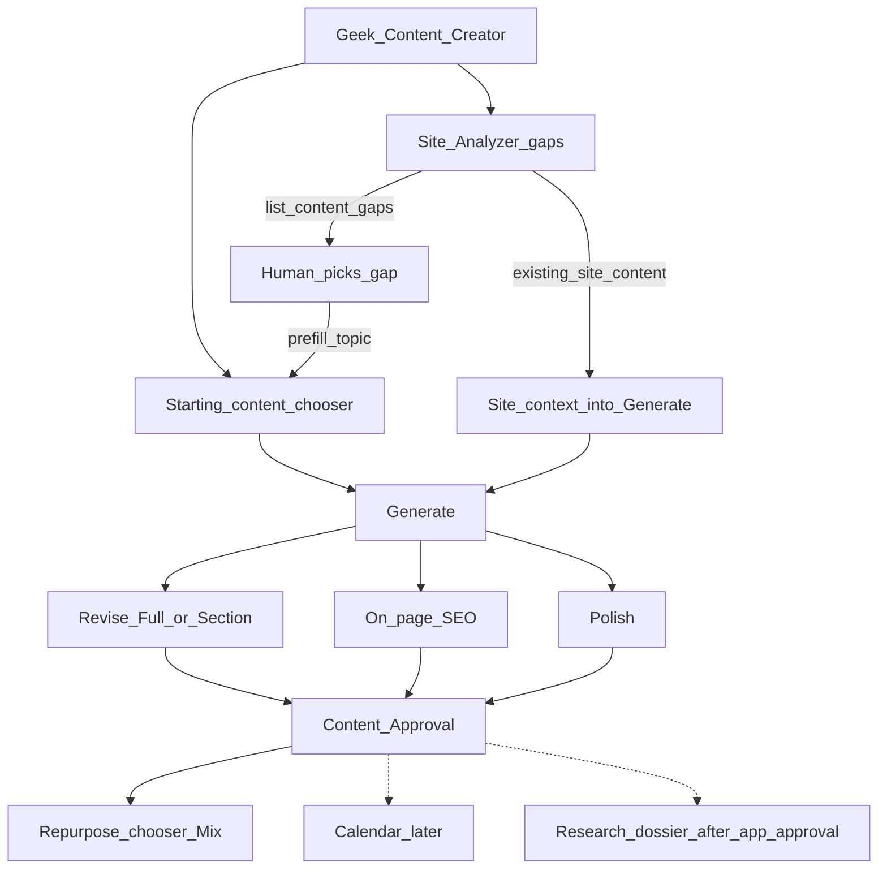

# Geek Content Creator — Plan

| | |
|--|--|
| **Status** | **Day-one first release: COMPLETE** (acceptance §13 all checked). Full document ≠ 100% — later phases and open items remain. |
| **Day-one** | Shipped — create/brief/research/generate, Site Analyzer gaps → create + site section context, revise / on-page SEO / polish / approve / repurpose, AI Tools, image prompts |
| **Later (not started)** | Research dossier, calendar, pixel render (§8) |
| **Open / optional** | Shared writing package extract; Repurpose presets; search provider when dossier phase starts (§14) |
| **Follow-on (code complete, not this plan’s §13)** | Geek-SEO sitemap generate as Analyze step 1 — implemented, unit-tested, and pushed to `main` across Geek-SEO/GeekAPI/GeekContentCreator, **not yet live-verified against a real domain**. Planning/handoff docs for this item were deleted post-merge; see commit history (Geek-SEO `281ec37`, GeekBackend `7ef3c61`, GeekContentCreator `efc2f23`) for detail. |
| **Next up (not started)** | Fallback elimination — [docs/FALLBACK_ELIMINATION_PLAN.md](./docs/FALLBACK_ELIMINATION_PLAN.md) · [inventory](./docs/FALLBACK_INVENTORY.md). Replaces Site Analyzer's fabricated content-gap fallback (5 hardcoded generic subtopics) with real heading-based gap detection; eliminates silent provider auto-switching (SERP/AI/geocode) and swallowed exceptions in Geek-SEO/GeekAPI; ports Content Writer v2's existing `.html`/`.txt` git export. |
| **New repo** | `/Users/jeffmartin/development/GeekContentCreator` |
| **Copies (same content)** | This file · `/Users/jeffmartin/development/CONTENT_CREATOR_PLAN.md` |
| **Last status update** | 2026-08-03 |

---

## Completion summary

| Scope | Status |
|-------|--------|
| First-release happy path (§5, §13) | **Complete** |
| Build sequence §12.1–5 | **Shipped** |
| Build sequence §12.6 smoke | Operator process — re-run as needed; not a code deliverable |
| Build sequence §12.7–8 / §8 later | **Not started** (after application approval) |
| §14 open items | **Open** (allowed after day-one) |
| Sitemap step-1 / uncapped crawl (Geek-SEO) | **Deployed** — separate handoff; not a §13 checkbox; not yet live-verified against a real domain |
| Fallback elimination (Geek-SEO/GeekAPI) | **Not started** — [docs/FALLBACK_ELIMINATION_PLAN.md](./docs/FALLBACK_ELIMINATION_PLAN.md); not a §13 checkbox |

---

## 1. One-sentence product

**Content Creator** is a new app that does Content Writer v2’s *job* (write the outputs you choose, including standalone image prompts) with a usable interface, **Site Analyzer** (content gaps **and** existing site content into create), revise, on-page SEO, polish, content approval, and post-approval repurpose — not Content Writer v2’s old screens and not Geek Content Workflow.

---

## 2. Naming rules (reviewers)

| Prefer (spell out) | Avoid |
|--------------------|--------|
| **Geek Content Creator** (product) / repo `GeekContentCreator` | Folder name `ContentCreator` |
| Content Creator | OK short name in UI copy when clear |
| Content Writer v2 | CWV2, CW2, CW |
| Geek Content Workflow | GCW |
| Site Analyzer (UI) | retired product name (do not use) |
| **Starting content** / **What to write** | Calling create-time selection “Mix” |
| **Repurpose** / **Repurpose chooser** | “Mix” without defining it |
| **Revise** | “Revise chat” (implies a message thread) |
| **Research dossier** (later only) | Shipping “Research Packet” in first release |
| **Content approval** vs **application approval** | Using “approval” ambiguously |
| — | Content Writer v3 / v4 |

**“Mix”** = post-**content**-approval **Repurpose chooser** only (types + counts).

**Content approval** = operator approves a draft artifact.  
**Application approval** = product go-ahead for this app; gates later phases (research dossier, etc.).

---

## 3. Tech stack and infrastructure (assumed)

Same platform family as Geek Content Workflow — not a new auth/API island.

| Layer | Assumption |
|-------|------------|
| App | Next.js app at `GeekContentCreator` |
| Auth | GeekOAuth |
| API / persistence | GeekAPI + GeekRepository; Content Creator owns its document/version/approval domain |
| Writing | Shared Content Writer v2 **generate engine** (orchestrator, prompt builders, image-prompt builders) as **in-process library and/or GeekAPI internal services** |
| Hosting | Confirm at scaffold (expect same Geek / Railway-class pattern as sibling apps) |

**Infrastructure today:** GeekOAuth, GeekAPI, Content Writer v2 on GeekAPI, and Geek Content Workflow facades are live. Content Creator GeekAPI surface (`/api/geek-content-creator/...`) owns creates, brief/research persistence, Site Analyzer gates, and generate. Next talks to **GeekAPI only** for that path.

**Writing package:** prefer copied / in-process Content Creator services under GeekAPI (`Services/ContentCreator/`). Do **not** edit the Content Writer v2 repo; copies become canonical when CWV2 retires.

---

## 4. Decisions locked

1. **New project** at `GeekContentCreator` — not inside Geek Content Workflow.  
2. **Framing:** same *job* as Content Writer v2; **new UI** — do not copy Content Writer v2’s interface.  
3. **Not** a remote client that only fills Content Writer v2 project API fields (`targetKeyword`, `notes`, uploads, `generate/pillar`).  
4. **Writing integration:** Content Creator owns documents/versions/approvals; shared generate engine as above.  
5. **Not** Content Writer v3 / v4.  
6. **Create:** human picks **starting content**. Pillar is **optional**.  
7. **Repurpose (Mix):** after **content approval** only. Human chooses types + counts; no auto full suite.  
8. **Revise:** feedback **textarea**; human chooses **Full** or **Section**; all content types; **new version** each time. Not a multi-turn chat thread.  
9. **SEO (first release):** on-page / structural only (draft + target keyword) — Geek Content Workflow analyzer class. Panel beside draft, on demand — not keystroke-realtime, not SERP coverage. Does **not** require a research dossier.  
10. **Site Analyzer — day one:** capability inside Content Creator (not the product name). **Understand the site** → topical map → **identify content gaps** → human picks a gap → **start a create**. Additionally, **existing site content** from that analysis (pages, headings, summaries, related pillars already on the site) **feeds into Generate** as creation context so new drafts align with what the site already says — not gap topic alone. Reuse site analyzer / Geek-SEO site model + gap signals; new usable UI.  
    **Fixes a Content Writer v2 gap:** entering a keyword from “home” / project setup did **not** pull reference content from the site **section** where that keyword or content gap lives. Content Creator **must not** repeat that — Generate for a Site Analyzer–started create is grounded in the **relevant site section** (related pages, headings, excerpts), not keyword-alone.  
11. **Research dossier (“Research Packet”)** — **descoped** to later phase **after application approval**. Includes formal packet, AI deep research, manual SERP/competitor uploads, research-backed coverage scoring. Site Analyzer site context in day one is **not** that dossier; it is the analyzed site model / excerpts available from Site Analyzer.  
12. **Calendar** later (after content-approval path works).  
13. **LLM budgets** derived from what the human selected (see §7).  
14. **Image prompts — day one:** standalone (human context required when not via Mix) and attached/Mix (artifact is context). Prompt **text** only; not pixel render.  
15. **AI Tools — day one:** context required, **source flexible** — artifact-derived names (pick which) **or** human-supplied name list + short brief. Not required: approved Pillar/TechArticle with a Tools section.  
16. **Repo path:** `/Users/jeffmartin/development/GeekContentCreator` (Next.js scaffolded; open this folder to continue).

### Writing integration — are / are not

| Are | Are not |
|-----|---------|
| New app + own persistence | Filling Content Writer v2 project fields as the product design |
| Shared Content Writer v2 generate engine **in-process inside GeekAPI**, or **copied** into `GeekAPI/Services/ContentCreator/` | Deep-link into Content Writer v2’s old screens |
| Engine in GeekAPI or shared package | Treating Content Writer v2 HTTP project API as the product contract |
| Site Analyzer Generate with **site section context** | Keyword-from-home Generate with **zero** site section reference (Content Writer v2 failure) |
| **Content Brief** + deep research (follow ≤3 organic URLs) on Content Creator creates (`BriefJson` / `ResearchJson`) | Trick keyword-source uploads / Google SERP heading scrape as research |
| Next → `/api/geek-content-creator/...` for brief, research, generate | Editing the Content Writer v2 **repo** (copy into Content Creator instead) |

**Correctness over expediency.** Content Writer v2 retires once Content Creator is proven; copied files become canonical Content Creator code (no upstream sync).

**Content Brief (day one — implemented):** human-selected intent, buying stage, audience, angle, CTA, tone-of-voice scales, length — fail closed with disabled Generate + inline required markers. Persist on create (`PATCH .../brief-research`); generate reads **server** `BriefJson` / `ResearchJson` only.

**Deep research (day one, not the later Research dossier — implemented):** SERP is an index (titles/URLs/PAA/related). Follow destination pages (≤3) via `POST .../research/follow`; article extract with caps (8 headings / 6 paragraphs / 200 heading / 500 paragraph chars); any URL fetch or empty extract fails the whole research op (URL + reason).

---

## 5. In scope (first release)

### Create → write → ship
- **Starting content** chooser (pillar optional; **Image prompt** is a valid starting type)  
- Topic / keyword (+ optional freeform notes — not a formal research dossier)  
- **Site Analyzer (day one):** site understanding → **content gaps** → start create from a chosen gap; **existing site content feeds Generate** as context  
- Generate starting content  
- **Image prompts** (standalone or attached)  
- **Revise** (textarea + Full/Section) per artifact, all types  
- **On-page SEO** + Polish + **Content approval**  

### After content approval — Repurpose chooser (“Mix”)

Human picks types + counts, then Generate:

| Type | Count control | Notes |
|------|---------------|--------|
| Blog post | on/off | If not already produced |
| TechArticle | on/off | |
| Email / cold email | count | |
| LinkedIn | count | |
| X / Twitter | count | |
| Instagram | count | |
| Meta ads | count | |
| Google ads | count | |
| AI Tools | count or name list | **Context required, not a fixed source.** From an artifact’s named tools when present (pick which), **or** human supplies tool names + short brief. Generate blocked if no names/context. Not required: approved Pillar/TechArticle with a Tools section. |
| Image prompts | on/off (or per selected artifact) | Context = approved artifact(s); no extra freeform required |

---

## 6. Feature locks (detail)

### Revise

| Rule | Detail |
|------|--------|
| UI | Feedback **textarea** (Geek Content Workflow revise pattern, purpose = revise) |
| Scope | Human chooses **Full** or **Section** every time |
| Applies to | All content types (including image-prompt artifacts) |
| Persistence | Always a **new version** |
| SEO / Polish apply-fixes | Via revise → new version |

### Image prompts (day one)

Content Writer v2 only generates image prompts after pillar + blog as a project step. Content Creator must support **just create an image prompt**.

| Path | Context | Mechanism |
|------|---------|-----------|
| **Standalone** (starting content; **not** via Mix) | **Required:** topic/title + description/notes. Generate blocked without context. | **1 LLM call** → structured prompt text (JSON). Not pixels. |
| **Attached / Mix** | Artifact body/sections are context; freeform optional | **1 LLM call** per artifact (or one section-batch for that artifact) |

Attached prompts available for **all content types**. Pixel render (image-generator) is **not** day one.

### AI Tools (day one)

Same spirit as image prompts: **context required, source flexible.**

| Path | Context |
|------|---------|
| **From an artifact** | Names available on a Pillar, TechArticle, or notes — human picks which tools to generate |
| **Human-supplied** | Tool names + short brief (what each is / angle). No approved long-form required |

Generate blocked only when there are **no tool names / no usable context**. Do **not** require “approved Pillar or TechArticle with a Tools section.” UI may use toggles when names already exist, or a name list + notes field otherwise. LLM: **~2** calls per selected tool (body + metadata).

#### Implementation contract (scaffold / generate API)

When building Content Creator, AI Tool generate **must** accept either input shape (same endpoint or one request DTO):

```text
ToolGenerateRequest:
  toolNames: string[]          # required, non-empty after trim
  brief: string | null         # human short brief / angle (required if no sourceArtifactId)
  sourceArtifactId: id | null  # optional — when set, names may be prefilled/filtered from artifact
  selectedNames: string[] | null  # optional subset when picking from artifact-derived list
```

- Reject generate if `toolNames` (or resolved selected names) is empty.  
- Do **not** gate on “content-approved Pillar/TechArticle with Tools section.”  
- Prefer extracting candidate names from `sourceArtifactId` when present; always allow override / full human list.  
- Persist one tool-page artifact per selected name; budget **~2** LLM calls each (body + metadata).

### Site Analyzer (day one) — gaps + existing site content into create

**Job:** (1) Find where the site is **missing** content so the operator can start writing there. (2) Use **what the site already has** as input when generating new content. Capability of Content Creator — not a separate product.

| Step | What happens |
|------|----------------|
| 1. Connect / analyze site | Crawl or load site model (site analyzer / Geek-SEO backed). **Implemented, pushed to main (not yet live-verified against a real domain):** every Analyze runs **sitemap generate as step 1** (uncapped discovery → URL inventory + auto-updated `sitemap.xml` artifact + Download); then **inventory-complete** site crawl. Fail closed on empty inventory or incomplete crawl — never empty soft-success. See Geek-SEO commit `281ec37`, GeekBackend `7ef3c61`, GeekContentCreator `efc2f23`. |
| 2. Topical map | Topics and headings the site covers (or should cover). **Utility pages** (`about`, `contact`, `faq`, …) are **excluded from topics**; they are still crawled for inventory / future Site Audit. |
| 3. **Identify gaps** | Topics/headings with **no page**; `suggest_pillar_page`-class; orphan pillars. **Known issue (not yet fixed):** when a pillar has <3 real crawled child pages, current code fabricates 5 hardcoded generic subtopics instead of finding real gaps — see [docs/FALLBACK_ELIMINATION_PLAN.md](./docs/FALLBACK_ELIMINATION_PLAN.md) items 1–2 for the real heading-based-detection fix (not yet implemented). |
| 4. Human picks a gap | Operator chooses one gap from the list |
| 5. Start create | Prefill topic / keyword / starting-content from that gap |
| 6. **Feed existing site content into Generate** | Pass site context into the writing engine: related existing pages (titles, headings, short excerpts/summaries), topical neighbors, voice/structure cues from the site model — so the draft fits the site, avoids duplicating pages, and can cross-link sensibly |

**Site context (day one) vs research dossier (later):** Site context = output of Site Analyzer’s understanding of **this** site. Research dossier = optional later AI deep research + manual SERP/competitor uploads. Day one Generate from a Site Analyzer create **must** include site context when a site analysis is attached; it must **not** require a research dossier.

**Problem this fixes (Content Writer v2):** Keyword entered from home / project setup often generated with **no reference** to existing pages or the **site section** where that keyword or content gap belongs. Content Creator Generate **must** attach that site section context (related pages, headings, excerpts) so drafts are site-grounded — **not** keyword-alone from “home.”

**Not:** Ahrefs competitor keyword-gap warehouse. **Not:** product named Site Analyzer. **Not:** keyword-alone Generate when Site Analyzer context is available.

**Day one acceptance:** (a) see content gaps, pick one, create prefilled; (b) Generate receives **existing site content from the relevant site section** (visible/inspectable — e.g. “using N related pages from this site section”); (c) smoke proves Generate is **not** keyword-only when site analysis is attached.

#### Implementation contract (scaffold / Generate API)

When building Content Creator, Generate for a Site Analyzer–started create **must** accept site section context (same generate request or attached create record):

```text
SiteSectionContext:
  siteAnalysisId: id
  gapTopic: string                 # chosen gap / keyword
  gapSectionPath: string | null    # topical path / department / section on the site
  relatedPages: [                  # required non-empty when siteAnalysisId set
    { url, title, headings[], excerpt }  # excerpt = short text from existing page
  ]
  topicalNeighbors: string[]       # related topic names from the map

GenerateRequest (Site Analyzer path):
  ...standard fields (starting content type, topic, notes)...
  siteSection: SiteSectionContext | null
```

- If create was started from Site Analyzer (`siteAnalysisId` present), **reject Generate** when `relatedPages` is empty / missing — do not allow keyword-only.  
- Prompt builders **must** include `relatedPages` + `gapSectionPath` + neighbors in the engine input (titles, headings, excerpts) — not only `gapTopic`.  
- UI shows that site context is attached (count of related pages / section path).  
- Creates **without** Site Analyzer may still Generate from topic/notes alone (pillar-optional path); this gate applies only when Site Analyzer context is claimed.

### SEO (day one)

Self-contained on-page checks: draft document + target keyword (lede/heading presence, density band, length, section count). No SERP, no research dossier dependency.

---

## 7. LLM call budget

| Selected | LLM calls |
|----------|-----------|
| Any social/ads with counts | **1** pack (chosen channels only — not one call per post) |
| Blog / TechArticle | **1** each |
| Email | **1 × count** |
| Each AI Tool | **~2** (body + metadata) |
| Each Revise | **1** |
| Image prompts (standalone) | **1** (human context required) |
| Image prompts (attached / Mix) | **1** per artifact (or one section-batch) |
| Starting long-form (pillar / blog / TechArticle) | Engine-defined (sectioned as required); not a fixed single call |

**Not allowed:** auto full repurpose suite on content approval; one LLM call per social post inside a pack; forcing pillar on every create; requiring research dossier for v1 generate or on-page SEO; **Site Analyzer–started Generate with keyword only and no site section context** (Content Writer v2 failure mode).

---

## 8. Explicitly later (after **application** approval) — **not started**

| Item | Status |
|------|--------|
| Research dossier (Research Packet) | Not started |
| AI deep research agent (search + fetch + cite) | Not started |
| Manual SERP / competitor / People Also Ask upload pipeline | Not started |
| Research-backed (Surfer-class) coverage SEO | Not started |
| Calendar | Not started |
| Pixel render of image prompts via image-generator | Not started |

---

## 9. Out of scope (first release)

- Content Writer v2’s old interface  
- Shipping inside Geek Content Workflow  
- Content Writer v3 / v4  
- Product branded Site Analyzer  
- Research Packet / research dossier  
- AI deep research pipeline  
- Formal manual research upload pipeline  
- Research-backed / Surfer-class SEO  
- Ahrefs-scale keyword warehouse  
- Scraping Google SERP HTML  
- Calendar  
- Multi-turn revise chat thread  
- Pixel render of image prompts  

---

## 10. Create loop



---

## 11. Existing systems (reuse vs ignore)

| System | Role |
|--------|------|
| Content Writer v2 | Job framing; shared generate / image-prompt **engine** — **not** UI to clone |
| site analyzer / Geek-SEO | **Site Analyzer** capability: site model, topical map, **content gaps**, and **existing page/content context for Generate** — not a separate SEO-only UI |
| Geek Content Workflow | Feature inventory (revise textarea, on-page SEO, polish, approval, packs) to **re-home** — not the product shell |
| GeekOAuth + GeekAPI | Auth and API infrastructure (assumed) |
| Content Writer v3 / v4 | Ignore |
| image-generator | Later: pixel render only |

---

## 12. Build sequence

| # | Item | Status |
|---|------|--------|
| 1 | Scaffold + GeekOAuth + GeekAPI + starting-content chooser | **Shipped** |
| 1b | Content Brief + deep research + generate on creates | **Shipped** |
| 2 | Generate + Revise + on-page SEO + Polish + Content approval on create workspace | **Shipped** |
| 3 | Standalone image prompt via Start create `type=imagePrompt` + attached/Mix | **Shipped** |
| 4 | Site Analyzer day one: gap → create with site section; Generate blocked if missing | **Shipped** |
| 5 | Repurpose chooser after content approval | **Shipped** |
| 6 | Smoke (Blog-only; SA gap → create; image prompt; AI Tools; Mix; Revise; approve → Repurpose) | **Process** — re-run as needed |
| 7 | After application approval: Research dossier + AI deep research + manual uploads + coverage SEO | **Not started** |
| 8 | Calendar / pixel render via image-generator | **Not started** |

---

## 13. Acceptance criteria (review / smoke) — **day-one COMPLETE**

All items below are done for first release:

- [x] Create Blog (or Email/Social) without a pillar.  
- [x] Pillar available when wanted.  
- [x] **Site Analyzer:** show **content gaps** for a site (topics/headings with no page / suggest-pillar-class gaps). *(Geek-SEO-backed; fail closed if site not analyzed)*  
- [x] **Site Analyzer:** pick a gap → Content Creator `/app/create` with topic prefilled + site section handoff (not CWV2 project form).  
- [x] **Site Analyzer:** Generate includes **existing site content from the relevant site section** (not keyword/gap title alone). *(real relatedPages on create; reject if empty)*  
- [x] **Regression vs Content Writer v2:** Site Analyzer–started Generate is **not** “home keyword with zero site section context.”  
- [x] Standalone image prompt create with required human context (blocked without context).  
- [x] Mix / attached image prompts use approved artifact as context.  
- [x] Image prompts for all content types when attached; prompt text only.  
- [x] Revise: Full or Section; new version; all types including image prompts.  
- [x] On-page SEO works from draft + keyword (no research dossier).  
- [x] Content approval required before Repurpose; Repurpose human-chosen; no auto suite. *(approval state from GeekAPI only)*  
- [x] **AI Tools:** generate with human-supplied name list + brief (no Pillar/TechArticle required).  
- [x] **AI Tools:** generate by picking names from an artifact when present.  
- [x] **AI Tools:** blocked only when no names/context — not blocked for missing Tools section.  
- [x] LLM usage matches plan section 7 budget (social/ads = one pack call; ~2 per AI Tool; 1 per revise / image-prompt path). *(Mix + project Social use `/social-pack`)*  
- [x] No Research Packet / AI deep research required for first-release happy path.  
- [x] No Content Writer v2 old project UI on happy path.  
- [x] Stack assumption: GeekOAuth + GeekAPI (confirm at scaffold).  
- [x] Repo is `/Users/jeffmartin/development/GeekContentCreator` (Next.js scaffolded).  
- [x] **Content Brief** required fields persist on create; Generate disabled until saved (inline required; no redirect).  
- [x] Generate reads persisted `BriefJson` / `ResearchJson` only (missing → `"brief required"`).  
- [x] Deep research follows ≤3 URLs with extract caps; any failure / empty extract fails the whole op.  
- [x] Content Writer v2 **repo** not edited for this feature (copy into GeekAPI Content Creator).  

**Not part of §13 (track separately):** sitemap generate as Geek-SEO Analyze step 1 — code complete, unit-tested, pushed to `main` (Geek-SEO `281ec37`, GeekBackend `7ef3c61`, GeekContentCreator `efc2f23`); **not yet live-verified against a real domain**.

---

## 14. Open items (allowed after day-one) — **still open**

| Item | Status |
|------|--------|
| Extract shared writing package vs GeekAPI in-process services first (same engine contract) | Open |
| Auth/hosting details confirmed at scaffold | Done (GeekOAuth + GeekAPI; Railway/Vercel as siblings) |
| Optional Repurpose presets (pre-fill only; still require Generate) | Open |
| Search provider — only when Research dossier phase starts (after application approval) | Not started (blocked on §8) |

---

## 15. Success

Someone uses **Content Creator** to find a **site content gap** (Site Analyzer), start create with that topic, and **Generate using existing site content as context**, or pick other **starting content** (pillar optional, or standalone image prompt with context), then revise / on-page SEO / polish / content-approve / repurpose — on GeekOAuth/GeekAPI, without a research dossier, without Content Writer v2’s painful screens.
