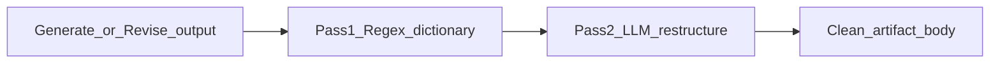

# Content Creator proposed changes (comprehensive)

| | |
|--|--|
| **Status** | Proposed — not implemented |
| **Repos** | GeekContentCreator (Next.js UI), GeekBackend (GeekAPI / GeekRepository), Geek-SEO (Site Analyzer upstream) |
| **Date** | 2026-08-04 |
| **Related Cursor plans** | Content Brief catalogs; Site_Analyzer_Functionality_Additions; Content Creator Proposed (living) |

This document consolidates the full proposed Content Creator change set: Content Brief catalog replacements, Google Ads API integration notes, tone/guardrail/prompt work, and Site Analyzer functionality additions.

**Objective:** align the Content Brief controls to Google's **documented** Search and Ads terminology so generated content is crafted to *known* Google attributes for SEO standing. Where Google publishes a taxonomy (audience segments, Full-Funnel stages, CTA types, E-E-A-T), use its exact names/values and cite the source. Where Google publishes **no** such taxonomy (a "tone" scale, content "angles"), those are internal editorial controls grounded in Google's quality guidance — not presented as Google attributes.

**Deploy order (when executing) — compat-first:** the backend validator does presence-only string checks on the *current* field names, so renaming a field before the UI emits it fails saves closed. Sequence: (1) backend accepts old-or-new names during a compat window → (2) deploy UI emitting the canonical Google-aligned values → (3) later tighten the backend to canonical-only. Brief fields stay opaque JSON, persisted in **both** `GccCreate.BriefJson` (server) and browser `localStorage` (`gcc-content-brief:`), with no version tag today — see §1.I.

### Source of truth per field (verified against Google, 2026-08)

| Field | Google-documented? | Source |
|-------|--------------------|--------|
| Audience Segments (§1.C) | **Yes** — Affinity, In-Market, Life Events, Detailed Demographics, Your Data, Custom | [Google Ads audience segments](https://support.google.com/google-ads/answer/2497941) |
| Buying stage / Full Funnel (§1.B) | **Yes** — Awareness / Consideration / Action | Google Ads Full-Funnel objectives |
| CTA Types (§1.E) | **Yes** — all seven are real enum values | [Google Ads `CallToActionTypeEnum`](https://developers.google.com/google-ads/api/reference/rpc/v21/CallToActionTypeEnum) |
| E-E-A-T (§1.F) | **Yes** — four signals: Experience, Expertise, Authoritativeness, Trustworthiness | [Google Search Central, Dec 2022](https://developers.google.com/search/blog/2022/12/google-raters-guidelines-e-e-a-t) |
| Search intent (§1.A) | Standard SEO taxonomy (origin: old Google research), **not** a live product enum | industry-standard |
| Tone of Voice (§1.F) | **No Google taxonomy** — internal editorial control | grounded in Google Helpful Content + E-E-A-T |
| Content Angle (§1.D) | **No Google taxonomy** — internal editorial control | grounded in matching SERP intent/format |

---

## Part 1 — Content Brief catalog replacements

**Sources:** [`src/lib/content-writer/brief-catalog.ts`](../../src/lib/content-writer/brief-catalog.ts), [`src/components/content-writer/ContentBriefPanel.tsx`](../../src/components/content-writer/ContentBriefPanel.tsx), GeekAPI [`GccGenerateService.ValidateBriefRequired`](file:///Users/jeffmartin/development/GeekBackend/GeekAPI/Services/ContentCreator/GccGenerateService.cs).

Pattern for every catalog: **full replacement** of selectable options; **map every legacy value** into the new set; persist **canonical** values on save.

### 1.A Primary & secondary search intent

| Field | Required | Values |
|-------|----------|--------|
| `primaryIntent` | Yes | `informational`, `navigational`, `commercial_investigation`, `transactional` |
| `secondaryIntent` | No | `local`, `freebies`, `comparison`, or `""` |

- Replace `SEARCH_INTENTS`; drop `ContentBrief.intent`
- Load migrate: legacy primary `intent` → `primaryIntent`; `local`/`comparison` → `secondaryIntent` only
- Backend: require `primaryIntent`; accept legacy primary `intent` as compat; do not require `secondaryIntent`

### 1.B Buying stage → Google Ads Full Funnel

Source: Google Ads Full-Funnel marketing objectives. Three options only (delete the invented Funnel + Analytics dual groups):

| Value | Label | Methods folded in |
|-------|-------|-------------------|
| `awareness` | Awareness (Top of Funnel) | CPM / CPV — impressions, reach, lift |
| `consideration` | Consideration (Middle of Funnel) | Engagement, interactions, video views / CPV |
| `action` | Action / Conversion (Bottom of Funnel) | CPA, value-based bidding, conversion tracking |

Legacy map: `tof_interest` → `awareness`; `mof_consideration` → `consideration`; `decision` / `bof_actions` / `retention` / `advocacy` → `action`.

### 1.C Audience Segments + Audience Details

**Audience Segments** (required; replaces `AUDIENCE_PRIMARIES`) — verbatim [Google Ads audience segments](https://support.google.com/google-ads/answer/2497941):

| Value | Label |
|-------|-------|
| `affinity` | Affinity Segments |
| `in_market` | In-Market Segments |
| `life_events` | Life Events |
| `detailed_demographics` | Detailed Demographics |
| `your_data` | Your Data Segments (Formerly Remarketing) |
| `custom` | Custom Segments |

Legacy `audiencePrimary`: `interest_affinity`/`cold_prospect` → `affinity`; `in_market` → `in_market`; `engaged_visitor`/`lead`/`customer`/`lapsed`/`lookalike` → `your_data`; `account_based`/`local_geo` → `custom`.

**Audience Details** (optional multi-select chips; replaces `AUDIENCE_MODIFIERS`):

| Value | Label |
|-------|-------|
| `demographic_attributes` | Demographic Attributes |
| `behavioral_triggers` | Behavioral Data Triggers |
| `boolean_combination` | Boolean Combination Logic |

Legacy modifiers: `demographic`/`firmographic` → `demographic_attributes`; `list_match` → `behavioral_triggers`; `life_event`/`buying_committee` → `boolean_combination`.

**Audience notes:** required freeform (`audienceNotes`; accept legacy `audienceDetail`). **Drop** `audienceExclude` (fold non-empty legacy exclude into notes on load).

### 1.D Angle for SEO

> **Note:** Google publishes **no** "content angle" taxonomy. These four are an internal editorial control, not a Google attribute. They should be chosen to *match the dominant intent/format of the SERP* (what Google actually rewards), not treated as canonical Google terms.

Four options only (field stays `angle`):

| Value | Label |
|-------|-------|
| `comparative` | The Comparative Angle ("Versus") |
| `problem_solution` | The Problem-Solution Angle |
| `case_study_data` | The Case Study / Data-Driven Angle |
| `ultimate_guide` | The Comprehensive "Ultimate Guide" Angle |

Legacy: `comparison` → `comparative`; `problem_solution` → `problem_solution`; `case_study` → `case_study_data`; `howto_workflow`/`explainer`/`listicle`/`objection_faq` → `ultimate_guide`.

### 1.E Discovery CTA Types

Seven options (field stays `ctaType`; optional `ctaLabel` unchanged) — all real values from Google's [`CallToActionTypeEnum`](https://developers.google.com/google-ads/api/reference/rpc/v21/CallToActionTypeEnum):

| Value | Label |
|-------|-------|
| `sign_up` | Sign Up |
| `contact_us` | Contact Us |
| `book_now` | Book Now |
| `download` | Download |
| `learn_more` | Learn More |
| `apply_now` | Apply Now |
| `get_quote` | Get Quote |

Legacy: `start_trial`/`subscribe` → `sign_up`; `book_demo` → `book_now`; `download` → `download`; `read_related` → `learn_more`; `contact_quote`/`buy` → `get_quote`.

### 1.F Tone of Voice (two methods)

**Philosophy:** natural, human-centric writing; helpful peer / trusted advisor; avoid rigid, hyper-optimized, keyword-stuffed prose.

> **Note:** Google publishes **no** "tone of voice" taxonomy — its content-quality signals are E-E-A-T (Method 2) plus the Helpful Content guidance. Method 1 is therefore an internal editorial control, not a Google attribute. Method 2 (E-E-A-T) *is* Google-documented and is the field that ties the brief to Google's quality framework.

**Method 1 — Tone of Voice** (internal editorial control; replaces bipolar `TOV_SCALES` / `TOV_PRESETS`):

| Value | Label |
|-------|-------|
| `consultant_professional` | Consultant / Professional Tone |
| `informational_instructional` | Informational / Instructional Tone |
| `commercial_balanced` | Commercial / Balanced Tone |

**Method 2 — Structural Evaluation (E-E-A-T)** (`eeatSignals[]`, required ≥1) — the full four Google signals per [Google Search Central](https://developers.google.com/search/blog/2022/12/google-raters-guidelines-e-e-a-t) (the earlier draft dropped `expertise`):

| Value | Label |
|-------|-------|
| `first_hand_experience` | First-Hand Experience |
| `expertise` | Expertise |
| `authoritativeness` | Authoritativeness |
| `trustworthiness` | Trustworthiness |

**Disable** tone options incompatible with Primary Intent ∩ Angle for SEO:

| Tone | Allowed intents | Allowed angles |
|------|-----------------|----------------|
| `consultant_professional` | informational, commercial_investigation, navigational | problem_solution, case_study_data, ultimate_guide |
| `informational_instructional` | informational, navigational | problem_solution, ultimate_guide |
| `commercial_balanced` | commercial_investigation, transactional | comparative, case_study_data |

Empty intersection → fall back to intent-allow + helper warning. Secondary intent does not gate voice.

### 1.G Content Brief panel layout

1. Primary intent \| Secondary intent  
2. Buying stage (Full Funnel)  
3. Audience Segments + helper  
4. Audience Details chips + helper  
5. Audience notes  
6. Angle for SEO  
7. Discovery CTA Types + optional CTA label  
8. Tone of Voice (gated) + E-E-A-T chips  
9. Length, SERP index fields  

### 1.H Backend brief validation

Update `ValidateBriefRequired` (`GccGenerateService.cs:114–134`, presence-only camelCase string checks today) for: `primaryIntent`, `buyingStage` (3 values), `audienceSegment`, `audienceNotes` (or legacy `audienceDetail`), `angle` (4 values), `ctaType` (7 values), `toneOfVoice` (3 values), `eeatSignals` (≥1). Add allow-lists + legacy remaps. **Accept old-or-new names during the compat window** (see deploy order) before tightening to canonical-only. Also surface *which* field is missing — the method already builds a `missing` list but throws a generic `"brief required"`. Optional: reject incompatible tone vs intent/angle.

### 1.I Persistence & migration surfaces (engineering)

The brief is opaque JSON with **no version tag and no value remapping anywhere today**. Renaming any field or catalog value silently persists stale values (the backend echoes `BriefJson` **verbatim** into the LLM prompt at `BuildBriefAndResearchBlock:141`, and UI `labelFor`/`buyingStageLabel` fall back to echoing unknown raw values). Add legacy→canonical remap at **all three read points**:

1. `loadBriefFromStorage` — browser `localStorage` load (`src/lib/content-writer/brief-catalog.ts`).
2. The `getGccCreate` → `JSON.parse` server-brief load in `ContentBriefPanel.tsx` (~91–104).
3. Guard the value-echo in `buildBriefBlock` so an unmapped legacy value can't reach the prompt.

**Helper/type churn** — these all hardcode the current field set and must change together in `brief-catalog.ts`: the catalogs, the `ContentBrief` interface, `emptyContentBrief`, `contentBriefMissingFields`, `isContentBriefComplete`, `buildBriefBlock`, `formatBriefAsHtml`; plus the `ContentBriefPanel.tsx` layout, ToV block, and gating. Replacing Tone of Voice (a six-slider numeric `Record`) with the 3-value control + E-E-A-T deletes `TOV_SCALES` / `TOV_PRESETS` / `TOV_NEUTRAL` and `buildToneOfVoiceSummary`, and needs a **defined legacy mapping** for old numeric briefs (e.g. unknown/all-neutral → `commercial_balanced`). Recommend adding a `briefVersion` tag so future term changes are migratable.

---

## Part 2 — Google Ads API Integration Layer

When working programmatically with Google’s ecosystem to pull metrics or validate criteria, use the standard **GoogleAdsService** / Google Ads .NET SDK architecture.

**Intent:** later validate or apply Audience Segments / Details against real campaigns (e.g. `CampaignCriterion` + `UserList` + bid modifiers). Not required for brief JSON catalog day-one.

Illustrative service shape (`AudienceTargetingService`): `GoogleAdsClient` → `CampaignCriterionService.MutateCampaignCriteria` with `CampaignCriterion` (`Campaign`, `BidModifier`, `UserList`).

**Notes:**

- Implement in GeekBackend / GeekAPI (or dedicated adapter), not Next.js  
- Needs credentials, customer/campaign IDs, SDK version pin (example V17)  
- Prefer read/validate metrics before mutate-in-production  
- **Naming collision:** `"GoogleAds"` already exists in the codebase as a *repurpose-pack channel label* (`GccController.cs` `GoogleAdsCount` → `GenerateRepurposePackAsync`) — that is ad-copy generation, **not** the Google Ads API. Keep the two concepts distinct when this lands.  

---

## Part 3 — Automated content guardrail

Two-layer guardrail in GeekAPI after generate/revise body (no personalization). Deterministic regex dictionary + LLM restructure — not “ask the model to try harder” alone.



### 3.1 PostgreSQL lookups

**Migration lane:** GeekBackend has two mechanisms — EF Core per-context and a raw-SQL runner. Add this table as an **EF migration on `ContentCreatorDbContext`** (`GeekRepository/Data/Migrations/ContentCreator/`) to match the domain, *or* as a numbered raw file `GeekRepository/Migrations/Sql/0034_*.sql`. Pick one; the raw SQL below is illustrative of shape, not the chosen lane.

```sql
CREATE TYPE jargon_action AS ENUM ('STRIP', 'REPLACE', 'RESTRUCTURE');

CREATE TABLE content_guardrail_rules (
    id UUID PRIMARY KEY DEFAULT gen_random_uuid(),
    banned_phrase VARCHAR(255) UNIQUE NOT NULL,
    action_type jargon_action DEFAULT 'STRIP',
    replacement_phrase VARCHAR(255),
    reason_code VARCHAR(100) NOT NULL,
    created_at TIMESTAMP WITH TIME ZONE DEFAULT CURRENT_TIMESTAMP
);
```

Seed (representative):

| banned_phrase | action_type | replacement_phrase | reason_code |
|---------------|-------------|--------------------|-------------|
| in today's fast-paced digital world | STRIP | NULL | AI_FILLER |
| delve deeper | REPLACE | examine | AI_FILLER |
| testament to | RESTRUCTURE | NULL | AI_FILLER |
| it is crucial to remember | STRIP | NULL | AI_FILLER |
| synergistic approach | REPLACE | collaborative strategy | CORP_JARGON |
| paradigm shift | REPLACE | fundamental change | CORP_JARGON |
| utilize | REPLACE | use | CORP_JARGON |
| moving the needle | REPLACE | achieving measurable results | CORP_JARGON |

### 3.2 Pass 1 — Regex

Load/cache rules; `\b`-bounded case-insensitive match; STRIP / REPLACE / flag RESTRUCTURE; normalize whitespace. C# `RegexGuardrail` under `GeekAPI/Services/ContentCreator/Guardrail/`. **Reuse:** `GcwPolishAnalyzer` already does read-only banned-phrase detection (`ContainsPhrase`) — a natural base for Pass 1; inspect the existing `ContentGuardRepository` before adding a new repo.

### 3.3 Pass 2 — LLM gate

Default: always after Pass 1 for body artifacts (skip image-prompt-only). Fast model, temperature 0; return only cleaned text; preserve markdown/code. Use existing GeekAPI LLM provider abstraction.

### 3.4 Orchestration

Hook the **instance** generate/revise paths (`GenerateStartingContentAsync:176`, `ReviseAsync:244`) after `LlmResponseJsonParser.ParseSections`, before persist. Optional: store `flaggedCount` / rule ids. Next.js does not run the guardrail.

### 3.5 Deferred

- Admin UI for `content_guardrail_rules`  
- Telemetry for most-flagged phrases  

---

## Part 4 — Four-phase consulting methodology prompt injection

When `toneOfVoice === consultant_professional` (and by default for ultimate-guide / deep architectural pieces), inject a structured system-appendix.

> **Resolve before building:** `IContentPromptBuilder` and the LLM provider abstraction do **not** live in GeekBackend — they are in the **external `content-writer-v2` repo** (referenced by `GeekAPI.csproj`), which this doc's global "Out of scope" forbids editing. So injecting via `IContentPromptBuilder` would violate that rule. **Recommended:** append the system-appendix at the GeekAPI call site (to the `ChatCompletionRequest` / prompt string `GccGenerateService` already assembles) — no content-writer-v2 edit required.

### Role

Senior IT Consultant — AI Implementation and BPA for local SMBs. Newspaper-style: objective, authoritative, technical, analytical.

### 4-phase methodology (weave into narrative)

| Phase | Action | Tone |
|-------|--------|------|
| 1. Business Objectives Alignment | Measurable goal / pain point | ROI, bottlenecks, cost of inaction |
| 2. Data Quality Assessment | Integrity, schema, storage | Pooling, JSONB, validation |
| 3. Tech Selection & Architecture | Specific tools over generics | Decoupled monoliths, routing, benchmarks |
| 4. Pilot Implementation Strategy | Execution, smoke tests, validation | Local integration, TDD, sandboxed rollout |

### Constraints

- Ban AI filler / clichés (align with guardrail dictionary)  
- First-person plural or objective third-person advisor  
- High scannability; peer-level technical assumed knowledge  
- Markdown `##`/`###` outline; closing FAQ from PAA/PAF  

Low temperature (≤ 0.2). Guardrail still runs post-gen. **Not** a parallel Next.js generate route.

---

## Part 5 — Site Analyzer functionality additions

Complementary to brief Angle for SEO. This work is specified in full in its own document — **[site-analyzer-functionality-additions.plan.md](./site-analyzer-functionality-additions.plan.md)** — which is the source of truth. Summary: feed three Google-evaluation lenses into Site Analyzer gap output so operators pick/prove an Angle for SEO —

1. **SERP shape summary** — top ~10 organic as format/intent roadmap; don't fight the dominant SERP shape.
2. **PAA / PAF clusters** — latent questions into outline/FAQ.
3. **Information Gain notes** — distinct perspective/data competitors miss.

Delivery slices, DTO shapes (`SerpShapeSummary`, `PaaPafCluster`, `InformationGainNote`), and the deferred scrape/vendor decisions live in that companion doc — kept there to avoid drift. Do not duplicate them here.

---

## Implementation checklist (review)

### Content Brief / UI (GeekContentCreator)

- [ ] Catalog replacements + Google source citations in `brief-catalog.ts` (E-E-A-T = four signals)  
- [ ] Legacy→canonical remap at all three read points (§1.I) + `briefVersion` tag  
- [ ] Helper/type churn: `ContentBrief`, `emptyContentBrief`, `contentBriefMissingFields`, `buildBriefBlock`, ToV→E-E-A-T  
- [ ] `ContentBriefPanel` layout and gated ToV  
- [ ] Docs: `CONTENT_CREATOR_PLAN.md`, `architecture.md`  

### Backend (GeekBackend)

- [ ] `ValidateBriefRequired` allow-lists + remaps, **compat-first** (old-or-new names), surfaced missing-field  
- [ ] `content_guardrail_rules` migration (EF on `ContentCreatorDbContext` **or** `0034_*.sql`) + seed  
- [ ] Regex + LLM guardrail in instance generate/revise paths (reuse `GcwPolishAnalyzer`)  
- [ ] Consultant Professional 4-phase appendix injected at the **GeekAPI call site** (no content-writer-v2 edit)  

### Site Analyzer (Geek-SEO / GeekAPI / UI)

- [ ] SerpShapeSummary / PaaPafCluster / InformationGainNote shapes  
- [ ] Gap UI + create handoff  

### Later / gated

- [ ] Google Ads API adapter (credentials first)  
- [ ] Guardrail admin UI + flag telemetry  
- [ ] Angle auto-variants / competitor schema scrape  

---

## Verification (how to test end-to-end)

- **UI unit tests** in `brief-catalog.ts`: legacy→canonical remap for every renamed catalog value and the ToV→E-E-A-T conversion; updated `contentBriefMissingFields`; four-signal `eeatSignals`; `buildBriefBlock` output for the new field set.
- **Backend tests** for `ValidateBriefRequired`: new required names, legacy-name compat acceptance, and the surfaced missing-field message.
- **Guardrail tests**: Pass-1 STRIP/REPLACE/RESTRUCTURE against seed rows; Pass-2 skipped for image-prompt-only.
- **End-to-end**: save a brief (confirm it round-trips localStorage **and** server `BriefJson`), run Generate against a create, confirm the `=== BRIEF ===` prompt block carries the canonical Google-aligned values. `scripts/smoke-site-analyzer.mjs` covers the Analyze→gaps path for Part 5.
- Keep the full backend suite green (~195/195).

---

## Out of scope (global)

- Separate DB columns for each brief field (stay in `brief_json` except guardrail rules table)  
- Personalization layer on guardrail  
- Editing the external Content Writer v2 repo — so the Part 4 prompt-appendix is injected at the GeekAPI call site, **not** via that repo's `IContentPromptBuilder`  
- Multi-select primary/secondary intent or multi-select audience **segments**  
