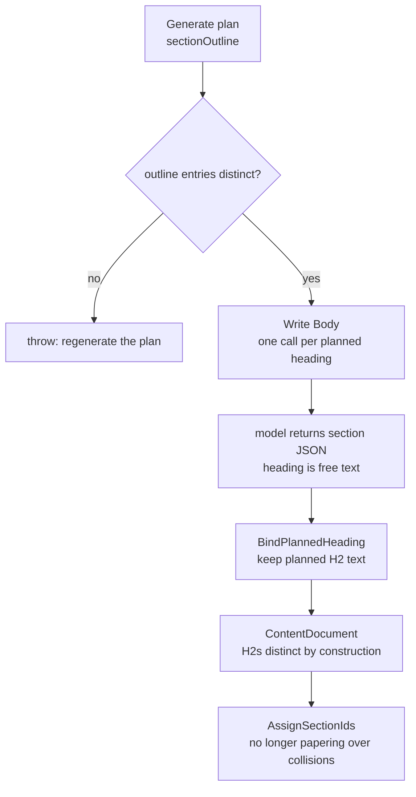

# Fix: pillar export emits the same h2 twice

**Status:** Fixed in **GeekAPI (not Node)** — `PillarHeadingContract` + heading binding in
`ContentGenerationOrchestrator`. 14 tests in `GeekBackend.Tests/PillarHeadingContractTests.cs`.

Found while hand-coding pillar exports into geekatyourspot. Hit two of two multi-section pillars.

## Symptom

Exported pillar HTML contains two `<h2>` with the **same text** but **different bodies** — two real
sections that ended up sharing a title, not duplicated content.

| Export | Duplicated `h2` | A | B |
|---|---|---|---|
| Automated Ad Spend Optimization | `Data Quality Assessments:` / `Data Quality Assessments` | 4 paras, h3 *Ensuring Data Integrity* | 3 paras, h3 *Tools for Data Validation*, *Automated Data Cleaning* |
| AI Content Creation Workflow | `AI Content Repurposing: Maximize Your Content's Reach` | 7 paras, 1 h3 | 11 paras, 2 h3 |
| AI Content Creation Workflow | `SEO Blog and Article Generation: Enhance Visibility with AI` | 9 paras, 2 h3 | 12 paras, 2 h3 |

## Root cause

`GenerateArticleBodyAsync` asks the model for one section per planned outline heading and stores the
result **keyed by that planned heading** — `sectionsByHeading[chunk[b]] = section`. The dictionary key
is therefore always distinct. But the document renders `section.Heading`, which is **whatever text the
model put in the JSON**, and nothing in `SectionsArrayJsonContract` or the batch prompt requires the
model to echo the planned heading back. The prompt only says *"one entry per heading listed below, in
the same order."*

So the model is free to rewrite or truncate the heading, and two genuinely different planned sections
can render identical `<h2>` text.

The Ad Spend export shows the mechanism plainly — **four of its five body H2s end in a dangling
colon**:

```
'Unlocking Automated Ad Spend Optimization'
'Dynamic Creative Optimization:'      <- truncated at the colon
'Automated Rules & Bidding:'          <- truncated at the colon
'Real-Time Budget Reallocation:'      <- truncated at the colon
'Data Quality Assessments:'           <- truncated at the colon
'Data Quality Assessments'            <- not truncated; collides with the line above
'People Also Ask'
```

No plan contains `"Dynamic Creative Optimization:"` with nothing after it. The model was given
`"Heading: Subtitle"` entries and dropped the subtitle on most of them. Where one entry was truncated
and another wasn't, the two collapsed onto the same string.

**Why nobody noticed:** `AssignSectionIds` runs `SlugHelper.EnsureUniqueSlug` afterwards, so the *ids*
come out unique (`data-quality-assessments`, `data-quality-assessments-2`). The duplicate headings
ship with working anchors and no error. Uniquifying the ids was hiding the defect, not fixing it.

**Second symptom, same cause:** image-prompt rows are keyed
`{articleSlug}-{sourceType}-h2-{headingSlug}` from the *rendered* heading, so colliding headings
collide as slugs too and `RemoveImagePromptRowsForSections` drops one. That is why Ad Spend has four
`pillar-h2` prompt files for five body sections. (An earlier draft of this doc claimed the prompt
generator and the body writer "walk different lists" — that was wrong. `BuildSectionTargets` emits one
target per top-level heading and does not dedupe.)

## Fix

The plan owns H2 text — the same ownership rule already documented on `Section.Id` ("Assigned in code
after generation … so the model never invents or omits it"). Heading was the one piece of planned
structure still taken on trust from the model.

**1. Bind the rendered heading to the planned outline entry.** New `PillarHeadingContract`:

| Member | Purpose |
|---|---|
| `HeadingKey` | Collision-compare form — trims, collapses whitespace, drops trailing `: - — – .` so `"Data Quality Assessments:"` and `"Data Quality Assessments"` compare equal |
| `HeadingDrifted` | Model heading differs from planned by more than whitespace |
| `WithPlannedHeading` | Returns the section carrying its planned heading; paragraphs and children untouched |
| `FindDuplicateOutlineHeadings` | Outline entries naming the same section twice |

`ContentGenerationOrchestrator.BindPlannedHeading` applies it at all three storage sites (lede/intro,
batch, per-section fallback) and logs a warning when the model drifted, so it is visible in Railway
rather than absorbed downstream.

**2. Refuse a malformed plan at the source.** Binding cannot help if the *outline itself* names one
section twice: both entries hash to one dictionary key, one section gets generated, and the final
`Select` renders it under both — duplicate H2s with identical bodies. `GeneratePillarPlanAsync` now
calls `RequireDistinctOutlineHeadings` and throws `ContentGenerationException` naming the colliding
spellings.

This deliberately does **not** rewrite the outline. `PillarOutlineNormalizer.Sanitize` is commented out
on purpose — "the stored plan is what gets written" — so a bad plan is rejected and regenerated rather
than silently repaired.



## What did NOT change

- The outline is still never rewritten.
- No section is dropped or merged; only the section's own H2 string is replaced.
- `EnsureUniqueSlug` stays — it is correct for genuinely distinct headings that slugify alike.

## Verification

`dotnet test GeekBackend.Tests` — 51 pass (37 existing + 14 new). Cases are the real failures:
colon-truncated vs untruncated pair, paragraphs/children preserved, obedient model returns the same
instance, duplicate-outline detection, and an end-to-end check that two distinct planned sections stop
colliding after binding.

To confirm against an export directory:

```python
import re, html, collections, sys, pathlib

def text(s):
    return re.sub(r"\s+", " ", html.unescape(re.sub(r"<[^>]+>", "", s))).strip()

for p in pathlib.Path(sys.argv[1]).rglob("*.html"):
    raw = p.read_text(encoding="utf-8", errors="ignore")
    h2 = [text(m.group(1)) for m in re.finditer(r"<h2[^>]*>(.*?)</h2>", raw, re.S)]
    norm = [h.rstrip(":").strip().lower() for h in h2]
    for d in [k for k, v in collections.Counter(norm).items() if v > 1 and k]:
        print(f"{p}: {[h for h in h2 if h.rstrip(':').strip().lower() == d]}")
```

A dangling-colon H2 in any future export means a heading is still reaching the renderer unbound.

## Already-shipped content

Both pillars are coded into geekatyourspot with the duplicates resolved by hand, and those choices are
**not** reproducible from a regenerated export:

- `ai-content-creation-workflow` — the two pairs were merged into single components.
- `automated-ad-spend-optimization` — kept as two sections; the second was named
  `data-validation-cleaning-section.tsx` with ids `-integrity` / `-validation`. Those names were
  invented downstream.

Regenerating either pillar will produce different heading text and ids. Diff against the existing
components rather than overwriting them.

## Related

- `docs/plans/fix-generate-tools-h4-h5-harvest.md` — heading-level assumptions in the tools harvest.
- `docs/plans/use-cases-copy-drift.md` — heading wording drifting between rendered copies.
