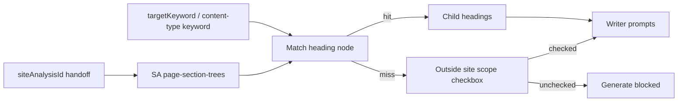

# Replace Crawl with Site Analyzer hierarchy context

## Goal

Remove Step 2 **Crawl Site** from Workflow (CWV2 project page). Writer page/site context comes from **Site Analyzer hierarchical headings**, not CWV2 crawl tone/focus.

**Acceptance (tiered by content length):** after matching a keyword to a hierarchy node, inject that node’s **child headings** into every Generate path. **Pillar and Blog** are rigorously checked: output must cover those child topics **as child headings** in the article/blog structure (e.g. H2/H3 under the matched topic — not only prose mentions). **Shorter types** (social, cold outreach, tools, image prompts, etc.) still receive the same hierarchy context as grounding, but are not required to exhaust every child heading — prompts treat children as topical guidance scaled to length.

Tone (**brief 1.F**) and crawl **Detected Focus** are **out of this phase**. Do not invent SA tone/focus or leave crawl-derived tone/focus in prompts. All other [`brief-catalog.ts`](../../src/lib/content-creator/brief-catalog.ts) methods (1.A–1.E and E-E-A-T) stay hidden until each passes operator tests — they come back later as a set, not stubs.

**Focus → what replaces it (now vs later):**
- Crawl Focus was topical (“what the site is about”). **This phase:** that job is **SA hierarchy** (keyword → node → child headings) — not a single brief field.
- It may later feel like a **combination** of operator brief controls (e.g. Intent + Angle + Audience) *plus* SA hierarchy for real site topics. Do not invent a new “Focus” catalog entry; when brief-catalog returns, use those existing methods.
- **Eventually:** restore **all** items in `brief-catalog.ts` (1.A–1.F + related brief fields) after each passes operator tests. Hierarchy remains the site-topic grounding; brief fields are operator editorial controls on top.

## No-fallback rules (this phase)

Aligned with [FALLBACK_INVENTORY.md](../FALLBACK_INVENTORY.md) and the project’s eliminate-silent-fallback stance:

- **Remove Crawl Site** — do **not** keep CWV2 crawl as a backup path for page/site context, tone, or focus.
- **No fabricated context** — do not invent hierarchy nodes, child topics, tone, or focus when SA data or a keyword match is missing.
- **Honest omission + explicit override** — on no hierarchy match, Generate is **blocked by default** (fail closed). Operator may check **“Keyword is outside site scope — generate without hierarchy context”** to unlock Generate; page/site hierarchy stays **absent** (no crawl/tone/focus filler). Warning remains visible while checked.
- **Surface failures** — tree load / `siteAnalysisId` missing must error or warn visibly; do not swallow and pretend context exists.
- **Tone / brief methods** — omit this phase (continue without); **eventually** re-enable **all** `brief-catalog.ts` items after operator tests — not stubs, not a fabricated Focus field.

## Defaults

- **Match:** project `targetKeyword` (per content type: same keyword for now; content types may later supply their own) against SA page-section trees for `siteAnalysisId` from workflow handoff — case-insensitive heading text / slug match.
- **On match:** inject breadcrumb + **child heading texts** (+ source page URL) into generation context; Generate enabled when keyword sources exist (no out-of-scope checkbox needed).
- **On no match (keyword outside site scope):** show warning; Generate **disabled** until operator checks **“Keyword is outside site scope — generate without hierarchy context.”** Then Generate may run with research uploads only — **no** hierarchy context, no crawl/tone/focus filler. Unchecking re-blocks Generate while still unmatched.
- **Out of this phase:** all brief-catalog methods (including Tone). Crawl Focus → SA hierarchy now; brief returns later in full.

## Existing operator methods — canonical source

**File:** [`src/lib/content-creator/brief-catalog.ts`](../../src/lib/content-creator/brief-catalog.ts)

| Section | Lines | Method |
| --- | --- | --- |
| 1.A | 13–32 | Search intent (primary / secondary) |
| 1.B | 34–44 | Buying stage (Full Funnel) |
| 1.C | 46–69 | **Audience** (segments + details) |
| 1.D | 71–83 | Angle for SEO |
| 1.E | 85–100 | Discovery CTA types |
| 1.F | 102–126 | **Tone of voice** (Method 1) + E-E-A-T (Method 2) |

Shape on `ContentBrief` interface: lines **195–218** (`toneOfVoice` at 206; no field named `focus` in this file).

UI that binds these: [`ContentBriefPanel.tsx`](../../src/components/content-creator/ContentBriefPanel.tsx). Brief was removed from `/app/workflow` in `fb7924c`; catalogs remain.

**This phase:** continue without **Tone** (1.F `toneOfVoice`) and without re-surfacing the rest of 1.A–1.E until each passes operator tests.

**What “Focus” was:** not a `brief-catalog` field. CWV2 crawl **Detected Focus** = inferred topical phrases from headings/paragraphs (`ToneFocusAnalyzer.DetectFocus` / LLM `BuildTopicFocusPrompt`).

**Replacement stance:**
- **Now:** SA hierarchy supplies topical grounding (Focus’s real job).
- **Maybe a combination later:** Intent (1.A) + Angle (1.D) + Audience (1.C) as operator framing, still with hierarchy for site topics — not a new catalog key named Focus.
- **Eventually:** add back **all** brief-catalog methods after operator tests; hierarchy stays; no crawl Focus fallback.

---

## Context today

- CrawlPanel + `canGenerate = crawl && keywordSources` gate:
  - [`src/app/app/workflow/projects/[id]/page.tsx`](../../src/app/app/workflow/projects/[id]/page.tsx)
  - [`src/components/content-writer/CrawlPanel.tsx`](../../src/components/content-writer/CrawlPanel.tsx)
- Generate prompts use crawl via `ProjectGenerationContext` (`DetectedTone`, `DetectedFocus`, `CrawledHeadings`, …) in Content Writer orchestrator / `ResearchBriefBuilder` (GeekAPI hosts the same engine).
- SA trees already available: Geek-SEO `page-section-trees` → GeekAPI `GetPageSectionTreesAsync`; workflow handoff already stores `siteAnalysisId`.

## Changes

### 1. UI — Workflow project page

- Remove `CrawlPanel` from the project page.
- Renumber remaining steps (Upload = 2, Notes = 3, Generate = 4+) for clarity.
- `canGenerate`: require keyword sources **and** (hierarchy match **or** out-of-scope checkbox); not crawl.
- Add **Site hierarchy context** panel: load trees for handoff `siteAnalysisId`, match keyword, show breadcrumb + child headings + source URL.
- On miss: warning that keyword is outside site hierarchy scope; show checkbox **“Keyword is outside site scope — generate without hierarchy context”**; Generate stays disabled until checked.
- Do not display Detected Tone / Detected Focus.

### 2. Backend — generation context

In CWV2/GeekAPI generation path (`BuildContext` / prompt builders):

- Stop requiring `project.CrawledSite!`. Delete crawl-as-context path from Workflow generate (no silent fallback to old crawl fields).
- Add optional hierarchy fields, e.g. `HierarchyPath`, `ChildHeadings`, `SourcePageUrl`.
- **Omit tone/focus from prompts entirely** this phase (empty/unset is not filled with heuristics or crawl leftovers).
- When building context for a generate call: resolve keyword → SA tree node → children; inject into **all** content-type prompt builders (not only pillar/blog).
- **Prompt strength by type:**
  - Pillar / Blog: explicit instruction that each SA child topic becomes a **child heading** in the outline/body (section headings, not buried in paragraphs only). Plan and body generation must honor that structure.
  - Shorter types: same child list as context, but instruction is soft — reflect relevant themes / pick what fits length; do not require those topics as headings.
- Persist `siteAnalysisId` on the project at create time from workflow handoff so generate is server-side complete.
- Backend: if no hierarchy match, refuse generate unless request includes explicit out-of-scope acknowledgment (mirror the checkbox); never invent hierarchy.

### 3. Content types + keyword

- Hierarchy context applies to **every** Generate step (pillar plan/body, blog, social, cold outreach, tools, image prompts).
- Each step uses a keyword (initially `project.TargetKeyword`) to select the hierarchy node whose **children** ground that write.
- UI may later add per-type keyword override; not required for acceptance if target keyword match works.

### 4. Operator-gated methods

- **Tone & Focus:** continue **without** them this phase — no UI, no prompt fields, no crawl-derived substitutes.
- Other gated methods unchanged by this plan.

## Files (primary)

- GeekContentCreator: project page, new hierarchy context panel, handoff usage, step labels
- GeekAPI / ContentWriter Application: `ContentGenerationOrchestrator.BuildContext`, `ResearchBriefBuilder` / `ContentPromptBuilder`, remove crawl requirement from Workflow generate path
- Persist link: project ↔ `siteAnalysisId` if not already stored

## Verification

- With SA analysis + matching keyword that has children:
  - **Pillar / Blog:** each matched child topic appears as a **child heading** in the generated structure (rigorous operator check on outline + body HTML).
  - **Shorter types:** output is topically consistent with hierarchy (soft check — not every child required as a heading).
- With non-matching keyword: Generate blocked until **outside site scope** checkbox; after check, generate runs **without** hierarchy context; no crawl/tone/focus filler.
- Crawl Site panel gone; no Tone/Focus shown or injected.
- Keyword upload still required for Generate.

## Out of scope

- Re-enabling brief-catalog methods this phase (Intent, Audience, Angle, CTA, Tone, E-E-A-T, etc.) — **eventually all return** after operator tests; not now
- Inventing a new “Focus” brief field (use hierarchy now; optional Intent+Angle+Audience combination later)
- Replacing keyword-source uploads
- Changing Site Analyzer crawl itself
- Keeping CWV2 crawl as any kind of fallback

## Todos

1. Remove CrawlPanel; renumber steps; hierarchy panel; `canGenerate` = sources + (match OR outside-scope checkbox)
2. Persist `siteAnalysisId`; match keyword → SA node → children; inject into prompts for all types; omit tone/focus; refuse generate without match unless out-of-scope ack
3. Operator verify: pillar/blog emit SA children as headings on match; miss blocks until checkbox; then generate without hierarchy filler