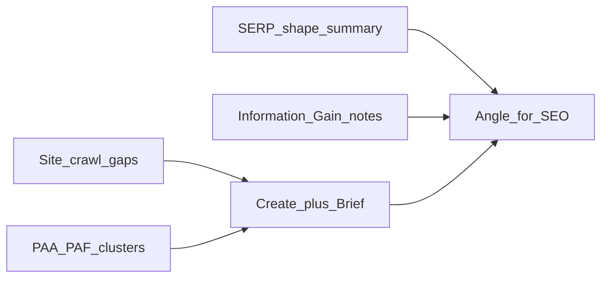

# Site_Analyzer_Functionality_Additions

| | |
|--|--|
| **Status** | Implemented locally — ready to commit (deploy / live smoke still pending) |
| **Repos** | GeekContentCreator (UI), GeekBackend / GeekAPI, Geek-SEO (site analysis upstream) |
| **Date** | 2026-08-04 |
| **Companion** | [content-creator-proposed-changes.plan.md](./content-creator-proposed-changes.plan.md) (Content Brief Angle for SEO, guardrail, prompts) |

## Purpose

Document **new Site Analyzer capabilities** that help operators (and later automation) choose and prove an **Angle for SEO** using how Google evaluates and rewards angles — complementary to the Content Brief catalog work (Primary/Secondary intent, Full Funnel, Audience Segments, Angle for SEO), not a replacement for it.

Today Site Analyzer ([`/app/site-analyzer`](../../src/app/app/site-analyzer/page.tsx)) crawls, maps coverage, lists **content gaps**, and hands off **site section context** into create/Generate. SERP/PAA on the brief is still **hand-entered** ([`ContentBriefPanel`](../../src/components/content-writer/ContentBriefPanel.tsx)); research dossier / live SERP scrape remains later-phase per [`CONTENT_CREATOR_PLAN.md`](../../CONTENT_CREATOR_PLAN.md).

## Slice 0 (prerequisite): strengthen the content-gap substrate

Everything below attaches to **content gaps**. Gap/topic detection previously leaned on **homepage H1/H2 only**; that is fixed — `HeadingPillarBuilder` now takes **H1–H6 from every crawled page** (post-crawl persisted heading set). Other candidate sources (sitemap, nav, schema, page content, links via `TopicCandidatePoolBuilder`) still contribute.

**Fix first (upstream Geek-SEO work):** read **every crawled page** H1–H6 (not homepage-only) — `HeadingPillarBuilder` + merge pool use the full persisted heading set after site crawl; lean harder on sitemap/nav/content sources so gaps are real before any SERP lens decorates them. Decorating sparse gaps with SERP data is premature.

## SERP ingest (restored Content Writer v2 file workflow)

The operator's established, ToS-safe method — from **Content Writer v2**, never finished there — is **file ingest**, not textarea entry: the operator runs the keyword search in their own browser, **saves the results page**, and the system parses it. This is distinct from a paid SERP vendor and from automated scraping (no bot queries Google), so the "rejected SERP HTML scrape" concern does **not** apply. This ingest is the primary SERP path; it produces the three lenses below.

1. **Input:** operator uploads the saved keyword search page (`.txt`/HTML). Use the **page-1** capture to harvest PAA (People Also Ask sits on page 1).
2. **Parse:** extract organic **title → URL** pairs, **related searches**, **PAA questions**, and infer **SERP shape** (dominant formats: listicle / guide / video / comparison).
   - *Worked example A (page 2, "AI Content Creation Workflow"):* ~10 clean organic title→URL pairs + 8 related searches, but **no PAA** (page-2 capture) — the tool must prompt for page 1.
   - *Worked example B (raw PAA dump from the operator's tool, ~70 questions):* ~50% off-topic (relevant: "How does AI optimize ad budgets in marketing", "Is it legal to use AI for advertising", "How does Coca-Cola use AI in marketing"; noise: "make $1000/day with AI", "richest YouTuber", "do YouTubers pay taxes", "jobs gone by 2030").
3. **Curate (mandatory):** present extracted PAA/results as a **select/deselect shortlist** with a relevance pre-check against the target keyword (pre-tick likely matches). Operator confirms. **Never auto-seed raw PAA** — the feed is noisy by nature.
4. **Seed:** confirmed items flow into the brief's **existing** SERP fields (`serpTitles` / `serpUrls` / `paaQuestions` / `relatedSearches`) via `serpIndexFromBrief` → `GccSerpIndex` — one source of truth, no parallel typed pipeline.
5. **Reverse the block:** replace the `ContentBriefPanel.tsx:494` copy ("Do not upload Google results HTML. Hand-enter titles/URLs/PAA") and the "rejected Google results-page HTML scrape" line below with this upload-and-parse flow. The textarea remains a manual fallback.
6. **Fragility caveat:** saved Google HTML markup churns; the parser must degrade gracefully (fall back to hand-entry) and tolerate class-name changes.

**Where it runs:** parser in **GeekAPI** (where research/brief JSON is processed and `GccSerpIndex` feeds generation); upload UI in Next via the existing `/api/site-analyzer/*` proxy pattern.

## Product framing: how Google evaluates and rewards your angle

Bake these three evaluation lenses into Site Analyzer outputs that feed create + Angle for SEO selection. **All three are outputs of the SERP-ingest step above** (plus, for Information Gain, the existing crawl) — they consume parsed SERP data, they do not require a paid provider. They differ sharply in operator cost: SERP shape is cheapest (glance at formats), PAA/PAF clusters overlap the existing `paaQuestions` field, and Information Gain is heaviest — **but** its "this-site coverage" half is already computed by the crawl, so a *partial* Information-Gain note (what this site already covers near the gap) is auto-generatable today with no SERP data at all.

### 1. Reverse-engineering search intent via the SERP

Treat the top ~10 organic results as a **roadmap** for dominant format and intent. Google tests pages against engagement; if winners are concise listicles, an expansive narrative may fight dominant intent.

**Site Analyzer addition (planned):** for a chosen gap/keyword, surface a **SERP shape summary** operators can use when picking Angle for SEO — e.g. dominant formats (listicle / guide / comparison / problem-solution), title patterns, and “do not fight the SERP” guidance. Ties to brief field `angle` (`comparative` | `problem_solution` | `case_study_data` | `ultimate_guide`). **Note:** the SERP-format → `angle` mapping is **advisory, not automatic** — `angle` is an internal editorial control, not a Google attribute (see companion doc). Either specify the mapping explicitly (e.g. listicle/guide-dominant → `ultimate_guide`; head-to-head → `comparative`) or leave it as operator guidance; do not auto-set `angle`.

### 2. Sourcing hidden demand (PAA & PAF)

Differentiate the angle by grouping **People Also Ask (PAA)** and **People Also Found (PAF)** modules into the core outline so content captures latent semantic queries beyond the head keyword.

**Site Analyzer addition (planned):** attach **PAA/PAF question clusters** to a gap (or to section context handed into create) so outlines and FAQ structure are driven by latent demand — not only crawled site headings. Aligns with existing hand-entered `paaQuestions` on the brief and eventual research index.

### 3. Satisfying the Information Gain threshold

Google looks for **Information Gain**: a distinct perspective, unique data asset, or structural breakdown competitors leave uncovered — driving stronger CTR and time-on-page.

**Site Analyzer addition (planned):** for each gap, produce an **Information Gain / competitor-gap note** — what related pages on *this* site already cover vs what top SERP competitors leave open — so Angle for SEO (especially case-study/data and problem-solution) is chosen to fill a real gap, not duplicate the SERP.

## Relationship to existing surfaces

| Existing | Role after these additions |
|----------|----------------------------|
| Content gaps + section context | Still required for Site Analyzer Generate |
| Brief Angle for SEO (4 options) | Human (or later AI) pick **informed by** SERP shape + Information Gain notes |
| Hand-entered SERP/PAA on brief | **Fallback** once the SERP-ingest tool lands; ingest+curate becomes the primary path |
| Deep research follow ≤3 URLs | Remains quoteable extracts; not a substitute for SERP-shape / PAA clustering |

## Reuse (don't rebuild)

- `serpIndexFromBrief` → `GccSerpIndex` (`src/lib/gcc-api.ts`) — the shape parsed SERP data seeds into; single source of truth.
- `SiteSectionContext` / `siteSectionForApi` (`src/lib/types.ts`, `src/lib/site-section-storage.ts`) and `writeSiteSectionHandoff` — the existing gap→create handoff channel to extend.
- Existing crawl coverage — supplies the "this-site coverage" half of Information Gain for free.

## Fix first (existing defects surfaced during review)

- **Slice 0 gap-substrate fix** (above) — homepage-H1/H2-only detection must be broadened before lenses add value.
- **Dropped handoff fields:** the gap → create handoff seeds only `topic` / `startingContentType` / `siteAnalysisId` / `siteSection`; the gap's `reason` / `sectionPath` are **dropped**, never reaching the brief (`CreateStartForm.tsx:112–120`, `site-section-storage.ts`). Close this before adding new seed fields.
- **`ContentGap` type duplication:** extend **both** `ContentGap` (`src/lib/types.ts:101–107`) and the duplicated inline `Gap` (`src/app/app/site-analyzer/site-analyzer-client.tsx:6–12`, which doesn't import `ContentGap`) — or de-dup first so they can't drift.

## Explicitly deferred (optional follow-ons — not day-one of this plan)

1. **Prompt injection logic** — make generate automatically spin Comparative vs Problem-Solution (etc.) angle variants from SERP/PAA/gain inputs.
2. **Automated SERP scrape / paid vendor** — a bot that fetches results pages itself (ToS-fraught) or a paid SERP API, replacing the operator-supplied-file ingest. This is the only path that was rightly deferred; the **operator-supplied-file ingest above is not deferred** and does not need a vendor decision.

## Suggested delivery slices (when execution starts)

Each slice names the owning repo (**Geek-SEO/GeekAPI produces**, **Next renders/seeds**):

0. **[Geek-SEO] Gap-substrate fix** — every crawled page H1–H6 into pillar candidates (prerequisite; crawl already persists per-page headings).
1. **[GeekAPI + Next] SERP-ingest tool** — file upload (Next) → parser (GeekAPI) → curate UI (Next) → seed brief SERP fields. Delivers the three lenses' input, provider-free.
2. **[Geek-SEO/GeekAPI] Spec DTOs** — `SerpShapeSummary`, `PaaPafCluster`, `InformationGainNote` on gap / section-context (reconcile with the brief SERP fields — single source of truth, not a parallel pipeline).
3. **[Next] Operator UI** — gap-detail view (net-new; today the gap list is flat) showing the lenses before “start create.”
4. **[Next] Handoff** — persist confirmed summaries into brief/research seed fields; fix the dropped `reason`/`sectionPath` here.
5. **Automation (later):** prompt-injection angle variants + the deferred scrape/vendor path.

## Verification

- **Parser unit tests** against the two real saved-SERP captures (page-2 → organic+related, no PAA; page-1 → includes PAA); assert title→URL pairing and organic/PAA/related separation.
- **Curation test:** relevance pre-check pre-ticks on-topic questions and leaves the money/clickbait noise unchecked; nothing seeds without operator confirm.
- **End-to-end:** `scripts/smoke-site-analyzer.mjs` (Analyze → gaps) still passes; after a gap handoff, confirm `reason`/`sectionPath` and curated SERP data reach the brief JSON.

## Implementation checklist (review)

- [x] **[Geek-SEO]** Broaden gap/pillar detection to every crawled page H1–H6 (not homepage-only) (slice 0)
- [x] **[GeekAPI+Next]** SERP-ingest: upload → parse → curate → seed brief SERP fields; reverse the “no HTML upload” copy
- [x] Specify `SerpShapeSummary` / `PaaPafCluster` / `InformationGainNote` and reconcile with brief SERP fields (single source of truth)
- [x] Site Analyzer gap-detail UI (net-new) for the three lenses
- [x] Fix dropped `reason`/`sectionPath` in handoff; de-dup `ContentGap` vs inline `Gap`
- [x] Verification per section above (parser fixtures + smoke)
- [ ] Keep prompt-injection variants and automated scrape/vendor as explicit later follow-ons
- [ ] Deploy Geek-SEO → GeekAPI → GeekContentCreator; live Analyze smoke on a real domain

## Out of scope for this plan document

- Implementing the Content Brief catalog renames ([content-creator-proposed-changes.plan.md](./content-creator-proposed-changes.plan.md))
- Replacing site section context with SERP-only Generate
- Committing to a paid SERP **vendor** or an automated live-scrape bot (the operator-supplied-file ingest is in scope and needs no vendor decision)
