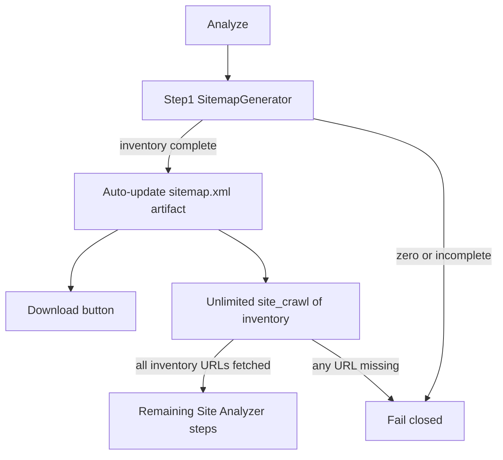

<!-- d6acda3d-499c-4cf5-aacc-ec517009899b -->
---
todos:
  - id: "revert-empty"
    content: "Remove LoadSitemapAsync empty soft-success; read step-1 inventory (never restore opaque GetRequiredArtifact path as primary)"
    status: done
  - id: "generator-engine"
    content: "Add SitemapGenerator (unlimited discovery) + XML builder; persist inventory + XML artifact"
    status: done
  - id: "first-step"
    content: "Make sitemap generate/update the first Site Analyzer pipeline step (always)"
    status: done
  - id: "unlimited-crawl"
    content: "Remove MaxSiteCrawlPages, DefaultAttemptBudget, Take(20), MaxUrls/MaxChildSitemaps; inventory-complete crawl"
    status: done
  - id: "competitor-unlimited"
    content: "Remove MaxPagesPerCompetitor=50; competitor crawl uncapped like own-site crawler"
    status: done
  - id: "strip-truncates"
    content: "Remove MaxListItems=30, persist 512k/32k caps, pillar Takes, MinPillars/DefaultMaxSeeds"
    status: done
  - id: "http-timeout-15s"
    content: "Raise SitePageCrawler HTTP timeout from 8s to 15s to match Playwright"
    status: done
  - id: "download-api-ui"
    content: "Auto-update sitemap.xml artifact + Site Analyzer Download (no root upload, no dedicated page)"
    status: done
  - id: "fail-closed"
    content: "Fail closed: zero generator URLs or incomplete crawl vs inventory → clear error; always regenerate (no 7-day reuse)"
    status: done
  - id: "crawl-url-filter"
    content: "Utility pages excluded from topics (NoisePaths); crawl fetches them for inventory (hard-junk skip only)"
    status: done
  - id: "deploy-verify"
    content: "Single PR/deploy GeekSeoBackend (+ GeekAPI/GCC if needed); stuck-profile recovery + advancement-moment assert"
    status: "pending — code complete/unit-tested only; not committed/pushed, not live-verified, stuck-profile recovery not run"
  - id: "readiness-compose"
    content: "Option1 map: Delegated stageComplete; throw on empty; inspect UNIQUE first then migrate-only-if-missing"
    status: "done — UNIQUE already present, no migration needed"
isProject: true
---
# Site Analyzer step 1: sitemap generate

**Handoff (implement next):** [../HANDOFF-site-analyzer-sitemap-step1.md](../HANDOFF-site-analyzer-sitemap-step1.md)  
**Status:** Code complete + unit-tested (191/191) across Geek-SEO, GeekAPI, GeekContentCreator; all three build clean. **Not yet live-verified against a real domain; not committed/pushed.** See "Implementation notes" in the handoff doc for full detail and flagged deviations. Docs updated 2026-08-03.  
**Canonical path:** `docs/plans/sitemap-generator-step1.plan.md` (project directory).

## Locked decisions (applied)
1. **Unlimited discovery + site crawl** — remove all of: sitemap-generator discovery caps, `MaxSiteCrawlPages = 20`, `DefaultAttemptBudget = 30`, `SitemapExtractor` `SampleUrls` **`Take(20)`**, `SitemapExtractor` **`MaxUrls = 5_000`** / **`MaxChildSitemaps = 3`**. No 7-day freshness; no `PagesFetched >= 1` soft-success.
2. **Competitor page crawl unlimited** — remove `MaxPagesPerCompetitor = 50` in [`CompetitorPageFetcher`](file:///Users/jeffmartin/development/Geek-SEO/GeekSeoBackend/Services/SiteExtraction/CompetitorPageFetcher.cs) and any `maxPages` cap in [`CompetitorAnalysisService`](file:///Users/jeffmartin/development/Geek-SEO/GeekSeoBackend/Services/CompetitorAnalysisService.cs). Competitor crawls use the same uncapped `SitePageCrawler` rules (no attempt-budget soft-stop; hard-junk skip only). (Competitor crawl remains the **analyze-competitors** path — not part of GCC `ThroughCoverage` spine unless separately requested.)
3. **Remove other arbitrary truncates** — `PageContentExtractor.MaxListItems = 30`; persist HTML/visible-text caps (`512_000` / `32_768`); pillar/topic `Take(10|20|8|…)`; `MinPillars = 3` and topical `DefaultMaxSeeds = 7` (and equivalent forced mins/caps in selector/merger/seed resolver).
4. **Per-URL timeouts** — raise HTTP fetch timeout from **8s** to **15s** to **match Playwright** page goto timeout in `SitePageCrawler`.
5. **Sitemap.xml delivery** — **auto-update** the generated `sitemap.xml` artifact on every Analyze, **and** always offer a **Download** button on Site Analyzer. FTP/root auto-upload remains vetoed.
6. **Crawl outcome (fail closed)** — own-site success only when the **full step-1 inventory** is fetched. Not “≥1 page.” Incomplete → hard fail.
7. **No freshness window** — every Analyze **regenerates** step 1. No artifact reuse by age.
8. **Utility pages are excluded from topics** — `/about`, `/contact`, `/privacy`, `/terms`, `/faq`, and similar never become pillars/topics (`NoisePaths` stays on topic/pillar selection only).
9. **Crawl still fetches those same utility URLs** — they belong in sitemap inventory / future Site Audit. Crawl skip list is hard junk only (assets, wp-admin, login, cart, feed, search, CDN) — **not** the full pillar `NoisePaths` list.
10. **Pillar / topic extractors** — do not use `Take`/MinPillars to invent or silently drop topic data.
11. **PAA** — SERP enrichment only; not a crawl URL filter.
12. **Composition = Delegated** — `RunThroughCoverageAsync` owns check-then-advance; this plan supplies step-1 / `site_crawl` `stageComplete()` predicates. Both apply; no supersession. (Reviews calling this “doc 41/42” used ghost symbols — map to Geek-SEO names only; do **not** invent `EnsureSiteMapAsync` / `SiteMapReady` / `sitemapEntities`.)
13. **Raise = throw** — empty inventory / incomplete crawl **throws**; runner marks step `error` and **halts** the pipeline. No soft early-return success.
14. **Idempotency fork (check first)** — before coding a migration, **inspect** `geek_seo.site_analysis_profile_discovered_urls` for UNIQUE on discovered-URL persistence. Code already declares unique index `(SiteAnalysisProfileId, Url, SourceType)` and uses `ReplaceDiscoveredUrlsAsync`. **If present in live DB → no migration** (verify only). **If missing → add UNIQUE migration as part of this fix.** Generator rows use `SourceType = generated`.
15. **Atomic ship** — one PR, one deploy unit (GeekSeoBackend; GeekAPI/GCC only if download needs them). Not “within a day of each other.”
16. **Review mapping = Option 1 only** — rewrite concerns onto real Geek-SEO symbols. Reject Option 2 (ghost-symbol plan) and Option 3 (second pipeline).

## Caps to delete (explicit checklist)

| Cap | Location | Action |
|-----|----------|--------|
| `MaxSiteCrawlPages = 20` | `SiteAnalysisStepExecutionService` | Remove |
| `DefaultAttemptBudget = 30` | `SitePageCrawler` | Remove |
| `SampleUrls` `Take(20)` | `SitemapExtractor` | Persist/return full URL list |
| `MaxUrls = 5_000`, `MaxChildSitemaps = 3` | `SitemapExtractor` | Remove (uncapped XML sitemap merge) |
| `MaxPagesPerCompetitor = 50` | `CompetitorPageFetcher` / competitor analyze | Remove |
| Full `NoisePaths` as crawl skip | `SitePageCrawler.ShouldSkipUrl` | Replace with hard-junk-only crawl filter |
| `MaxListItems = 30` | `PageContentExtractor` (homepage `<li>` harvest) | Remove — harvest all qualifying list items |
| Persist truncation `512_000` HTML / `32_768` visible text | `SiteAnalysisStepRelationalLoader` | Remove — persist full visible text from fetched HTML |
| Pillar/topic `Take`s (child slugs 10/20, tags 8, exclusion sample 20) | `SiteAnalysisStepExecutionService` / extractors | Remove arbitrary `Take` truncates on pillar/topic outputs |
| `MinPillars = 3`, topical map `DefaultMaxSeeds = 7`, etc. | `PillarSelector` / `PillarMerger` / `SiteAnalysisTopicalMapSeedResolver` | Remove forced minimums / seed caps |
| HTTP crawl timeout **8s** vs Playwright **15s** | `SitePageCrawler` | Raise HTTP per-URL timeout to **match Playwright (15s)** |
| 7-day freshness / `PagesFetched >= 1` | (plan leftovers) | Already vetoed — do not reintroduce |

## Utility pages vs crawl (two rules)

**Rule A — topics:** Utility pages (`about`, `contact`, `privacy`, `terms`, `faq`, …) **are excluded from topics**. Keep [`NoisePaths`](file:///Users/jeffmartin/development/Geek-SEO/GeekSeoBackend/Services/SiteExtraction/NoisePaths.cs) on pillar/nav/topic selection so those slugs never become pillars.

**Rule B — crawl / inventory:** Those same URLs **are fetched and persisted** for sitemap inventory and future Site Audit. Today [`SitePageCrawler.ShouldSkipUrl`](file:///Users/jeffmartin/development/Geek-SEO/GeekSeoBackend/Services/SiteExtraction/SitePageCrawler.cs) wrongly calls `NoisePaths.IsNoise` and drops them from fetch — fix that.

**Crawl still skips hard junk only:** assets (pdf/images/css/js/…), `wp-admin` / login / cart / checkout, feeds, search endpoints, CDN plumbing.

Implementation: crawl-specific skip (hard junk only). Sitemap generator uses the same crawl filter. `NoisePaths` remains topic-only.

## Crawl: cause → fail (binary)

| Cause | Today (wrong) | Required (fail closed) |
|------|----------------|-------------------------|
| No URL inventory before/without step 1 | Opaque `Required artifact 'site_urls'…` or empty soft-continue | Step 1 **always** runs first; crawl reads persisted inventory |
| Step-1 generator finds 0 URLs | Soft/opaque later | **Fail at step 1:** `Sitemap generation found no pages for {domain}` (crawl never starts) |
| Crawl incomplete vs inventory (any URL missing / 0 pages / only homepage when inventory is larger) | Soft-complete with N≥1 or N=0 under attempt budget | **Fail:** clear error listing incomplete crawl (must fetch **full** inventory) |
| Individual URL timeout / empty HTML / bot block | Skip, then soft-complete | Retry/exhaust inventory; if that URL remains unfetched → crawl **Fail** (no partial soft-success) |
| `DefaultAttemptBudget` / `MaxSiteCrawlPages` truncate mid-inventory | Soft-stop, still **complete** | **Removed** — not a success path |
| Persist inventory / site structure fails | **Fail** with persist message | Keep **Fail** (already correct) |
| Cancel / 15m stale processing | **Fail** timeout | Keep **Fail** (already correct) |

**Rule:** crawl succeeds only when **every** step-1 inventory URL is successfully fetched. Otherwise **present the error**. No attempt-budget soft-complete; no “≥1 page is enough.”

## Composition & readiness (resolved review items)

Reviews that mention `EnsureSiteMapAsync` / `SiteMapReady` / `sitemapEntities` map onto **this** stack — not a separate SeoProfile workflow:

| Review term | This codebase |
|-------------|----------------|
| Sitemap readiness / SiteMapReady | Step 1 complete + persisted inventory (not XML string alone) |
| `sitemapEntities` | Rows in `geek_seo.site_analysis_profile_discovered_urls` |
| Doc 41 check-then-progress | [`RunThroughCoverageAsync`](file:///Users/jeffmartin/development/Geek-SEO/GeekSeoBackend/Services/SiteAnalyzerService.cs) + per-step status |
| `EnsureSiteMapAsync` early return on empty shell | Soft-success / “content string exists” paths — vetoed; **throw** instead |

### 1. Completeness threshold (not bare `Count > 0` alone)
**Step 1 may mark complete only when all of:**
- `discoveredUrls.Count > 0`
- every row `SourceType` is `sitemap` or `generated` (real discovery — never invent placeholder rows)
- every URL is same-origin to the analyzed domain
- XML artifact was rewritten from that inventory (readiness ≠ non-null empty shell)

**Honest limit:** there is no separate `origin: crawled|seeded|placeholder` column today. Discriminator is **`SourceType`**. `Count > 0` alone cannot tell a legit single-page site from a fake placeholder — so we **forbid writing placeholders** and require `SourceType ∈ {sitemap, generated}`. A real one-URL site is allowed.

**`site_crawl` may mark complete only when** every step-1 inventory URL was successfully fetched (stricter than count). That closes the “one placeholder advanced the stage” class of bug for content crawl.

### 2. Composition pattern = **Delegated** (not layered belt-and-suspenders)
- Framework (`RunThroughCoverageAsync`): after each step returns, advance/persist step status; on throw → `error` + stop.
- This plan: implements `stageComplete()` for **step 1** and **`site_crawl`** (predicates above).
- Does **not** supersede the ThroughCoverage runner; does **not** add a second coarse gate in front of these checks.

### 3. Raise error = **throw**
Empty inventory, empty XML-only shell, or incomplete crawl → **throw** a clear exception. Caller does not soft-return success. Consistent with ThroughCoverage hard-fail-on-any-step-failure.

### 4. Idempotency — **inspect UNIQUE first, then decide**
1. **First implementation step for this item:** query/inspect whether `site_analysis_profile_discovered_urls` already has a UNIQUE constraint covering discovered-URL identity (expected: `(SiteAnalysisProfileId, Url, SourceType)`).
2. EF model already declares that unique index + `ReplaceDiscoveredUrlsAsync` replace semantics.
3. **Branch:**
   - Constraint **present** → no schema change; tests assert re-Analyze does not duplicate / does not unique-violate.
   - Constraint **absent** → **add UNIQUE migration** in this same fix (not a follow-up).
4. Generator persists `SourceType = generated`. Do not invent a parallel `sitemap_entities` table.

### 5. Broken / stuck profiles — recover on next Analyze
- Empty shells / empty inventory do not count as complete.
- Next Analyze **always regenerates** step 1 and **replaces** discovered URLs; no manual cleanup migration.
- Mid-pipeline stuck profiles: re-Analyze re-enters ThroughCoverage from the start of this run path and re-applies predicates.
- **Verify:** pick a currently stuck profile, run once, confirm recovery through coverage/gaps without manual DB edits.

### 6. Deploy sequencing = **same PR / same deploy**
Ship this work as one GeekSeoBackend deploy unit with the ThroughCoverage fail-closed behavior it depends on. If Download needs GeekAPI/GCC, include those in the **same** release train (merged before deploy; no window with only half shipped).

### 7. Verification must assert the check at advancement time
Not only eventual “gaps exist.” Required:
- Integration test: inventory empty → step 1 does **not** complete / pipeline does not advance.
- Integration test: inventory non-empty with wrong/missing SourceType → fail.
- On success path: log (or test assert) at mark-complete: `step1 complete, inventoryUrls: N` with N > 0.
- Re-Analyze idempotency: second run does not duplicate unique key violations; inventory replaced cleanly.
- Stuck-profile recovery smoke (item 5).

## Review summary
Site Analyzer’s first pipeline step is a Semrush-style **sitemap generator** (crawl same-origin URLs → URL inventory + downloadable XML; **no discovery cap**). It **always regenerates on Analyze** (no freshness reuse). Missing public `/sitemap.xml` is a normal input condition, not a reason to invent empty success. Zero discovered URLs remains a **hard failure**. Crawl must fetch the **full** inventory or fail. No dedicated Sitemap page in Content Creator. **Auto-update** the generated `sitemap.xml` artifact on each Analyze, **and** offer **Download**. **Do not** auto-upload to hosting root. No Search Console submit. Site content crawl is unlimited.

## Rules (non-negotiable)
- **Fail closed.** Do not mask failures as “fallback,” “demo,” or empty soft-success.
- **Step 1 always runs** on every Analyze and is the source of URL inventory. Do **not** “restore” the old `GetRequiredArtifact('site_urls')` path as the normal way crawl gets seeds — that was the opaque failure mode.
- Remove the local `LoadSitemapAsync` soft-success that returns `new SitemapData([], 0, [])` (vetoed). After step 1, loader reads persisted inventory (`sitemap` / `generated`). If inventory is still empty, fail with a **clear** generator/crawl error — not the artifact message.
- **No dedicated Sitemap page** in this application (Content Creator).
- **Sitemap delivery (both required):** (a) **auto-update** the generated `sitemap.xml` artifact whenever step 1 runs; (b) **Download** button on Site Analyzer whenever the artifact exists. **Do not** auto-upload into the customer’s hosting root (FTP/cPanel/public_html).
- **No GSC submit.**
- **Unlimited discovery + inventory-complete crawl + uncapped competitor crawl.** Remove `MaxSiteCrawlPages`, `DefaultAttemptBudget`, `SampleUrls` `Take(20)`, `MaxUrls`/`MaxChildSitemaps`, and `MaxPagesPerCompetitor`. Also remove `MaxListItems=30`, persist 512k/32k truncation, pillar/topic `Take`s, `MinPillars` / `DefaultMaxSeeds`. HTTP per-URL timeout **= Playwright (15s)**. **Utility pages are excluded from topics**; crawl still fetches them (hard-junk skip only — not pillar `NoisePaths`). Own-site success = **all inventory URLs fetched**. No 7-day freshness; no ≥1-page soft-success.

## Problem being fixed
Analyze failed with `Required artifact 'site_urls' for step 'site_urls' is not available` when no sitemap-sourced URLs were persisted and step-log artifacts were stripped. That is a real empty-inventory failure. The fix is not to bypass it; it is to make **sitemap generation step 1** so the pipeline always has a real URL inventory (or fails clearly).

## Product shape
| Item | Decision |
|------|----------|
| What | Crawl-based sitemap generator (Semrush-style: crawl → XML; discovery uncapped) |
| When | **Always** as Site Analyzer **step 1** on every Analyze (always regenerate; **no** 7-day freshness reuse) |
| Output | Persisted URL inventory for later steps + XML artifact |
| UI | Existing Site Analyzer surface only; **Download sitemap** when artifact exists |
| Sitemap.xml | **Both:** auto-update generated artifact on every Analyze **and** Download button on Site Analyzer |
| Site crawl | **Unlimited** + **inventory-complete**; competitor crawl **unlimited** (no 50/page) |
| Not | Dedicated page, GSC, empty soft-continue, crawl/extractor soft caps (20/30/50/5000/Take/MinPillars/seeds/list-30/512k/32k), HTTP timeout &lt; Playwright, 7-day/≥1, FTP/root upload, treating utility pages as topics, using pillar NoisePaths as crawl skip |

## Implementation

### 1. LoadSitemapAsync after always-run step 1 (not “restore artifact fail”)
- **Remove** the vetoed soft-success `return new SitemapData([], 0, [])`.
- **Do not** make crawl depend on restoring `GetRequiredArtifact("site_urls")` as the happy path — step 1 **always** persists inventory first.
- `LoadSitemapAsync` reads relational discovered URLs from step 1 (`sourceType` sitemap and/or generated). Pass real step log only if needed for pillars metadata.
- If inventory is empty **after** step 1 completed, that is a **step-1 failure** with a clear message (`Sitemap generation found no pages…`), not an opaque artifact error at crawl time.
- Delete/rewrite tests that assert empty soft-success; add tests that step 1 always runs and crawl loads persisted inventory.

### 2. SitemapGenerator engine (Geek-SEO)
- New service under [`GeekSeoBackend/Services/SiteExtraction/`](file:///Users/jeffmartin/development/Geek-SEO/GeekSeoBackend/Services/SiteExtraction/).
- Homepage start, same-origin BFS, Playwright when available, **unlimited discovery**. Crawl filter: include utility URLs; skip hard junk only. Utility pages remain **excluded from topics** via `NoisePaths` on pillar selection.
- Build standard `urlset` XML.
- Merge any public XML sitemap URLs from [`SitemapExtractor`](file:///Users/jeffmartin/development/Geek-SEO/GeekSeoBackend/Services/SiteExtraction/SitemapExtractor.cs) into the inventory when present (enrichment, not a substitute for running step 1).
- In `SitemapExtractor`: remove **`Take(20)`** on `SampleUrls`, remove **`MaxUrls = 5_000`** and **`MaxChildSitemaps = 3`** — return/merge full discovered URL sets.
- Persist full step-1 inventory.

### 3. First pipeline step (not a bypass)
- Insert/rename catalog step so sitemap generate/update is **step 1** of Site Analyzer (before or replacing today’s thin `site_urls` extract-only behavior).
- **Always regenerate** on Analyze — no 7-day (or any) freshness reuse of a prior artifact.
- If zero URLs → **throw** (halts ThroughCoverage; step status `error`). Message e.g. `Sitemap generation found no pages for {domain}`. Never soft-return; never opaque artifact message.
- Mark step complete only after inventory predicates in §1 (Composition & readiness) pass; log `inventoryUrls: N`.
- Downstream `LoadSitemapAsync` reads the persisted inventory from step 1.

### 4. Unlimited + inventory-complete `site_crawl` + crawl URL filter
- Remove `MaxSiteCrawlPages = 20` and `DefaultAttemptBudget` soft-stop in [`SitePageCrawler`](file:///Users/jeffmartin/development/Geek-SEO/GeekSeoBackend/Services/SiteExtraction/SitePageCrawler.cs) / [`RunSiteCrawlAsync`](file:///Users/jeffmartin/development/Geek-SEO/GeekSeoBackend/Services/SiteAnalyzerStepRunners/SiteAnalysisStepExecutionService.cs).
- Crawl full step-1 inventory (no numeric page/attempt ceiling that marks success early).
- After crawl: success only if **every** inventory URL was successfully fetched. If any inventory URL is missing → **throw** clear error (do not treat `PagesFetched >= 1` as success).
- **Utility pages excluded from topics** (`NoisePaths` on pillar selection). **Crawl still fetches** those URLs for inventory / Site Audit — skip hard junk only (assets, wp-admin, login, cart, feed, search, CDN), not full `NoisePaths`. Sitemap generator uses the same crawl filter.

### 4b. Competitor crawl uncapped
- Remove `MaxPagesPerCompetitor = 50` from [`CompetitorPageFetcher`](file:///Users/jeffmartin/development/Geek-SEO/GeekSeoBackend/Services/SiteExtraction/CompetitorPageFetcher.cs).
- Update [`CompetitorAnalysisService`](file:///Users/jeffmartin/development/Geek-SEO/GeekSeoBackend/Services/CompetitorAnalysisService.cs) to call `CrawlAsync` **without** a page cap (same uncapped crawler as own site).
- Does **not** add competitor crawl into GCC `ThroughCoverage` Analyze spine in this plan — only lifts the 50-page limit on the existing analyze-competitors path.

### 4c. Strip remaining arbitrary truncates + align HTTP timeout
- [`PageContentExtractor`](file:///Users/jeffmartin/development/Geek-SEO/GeekSeoBackend/Services/SiteExtraction/PageContentExtractor.cs): remove `MaxListItems = 30` and the hardcoded `>= 30` in the Playwright script — collect all qualifying list items.
- [`SiteAnalysisStepRelationalLoader`](file:///Users/jeffmartin/development/Geek-SEO/GeekSeoBackend/Services/SiteAnalyzerStepRunners/SiteAnalysisStepRelationalLoader.cs): remove `MaxHtmlCharsForVisibleText` / `MaxVisibleTextChars` truncation when persisting visible text.
- Remove pillar/topic arbitrary `Take`s (e.g. child slugs 10/20, focus tags 8, exclusion sample 20) in step execution / related builders.
- Remove `MinPillars = 3` forced fill and topical `DefaultMaxSeeds = 7` (and equivalents in `PillarSelector` / `PillarMerger` / `SiteAnalysisTopicalMapSeedResolver`) — do not invent pillars to hit a minimum.
- [`SitePageCrawler`](file:///Users/jeffmartin/development/Geek-SEO/GeekSeoBackend/Services/SiteExtraction/SitePageCrawler.cs): set `HttpFetchTimeoutSeconds = 15` to match Playwright goto timeout (15_000 ms).

### 5. Auto-update sitemap.xml artifact + Download (both required; no dedicated page; no root upload)
- Step 1 **always writes/updates** the stored `sitemap.xml` artifact for the profile/domain (replace stale or empty shells — readiness is real URL inventory + current XML, not “content string exists”).
- Geek-SEO (+ GeekAPI proxy as needed): GET that XML for download.
- Content Creator Site Analyzer UI: **Download sitemap** control whenever the artifact exists (required UI, not optional/hidden).
- **Vetoed:** automatically uploading the file into the customer’s site root / hosting filesystem.

### 6. Verify
- Tests: always regenerate; zero-URL fail-closed; inventory-complete crawl; no 20/30/50/5000/Take/MinPillars/seeds/list-30/512k/32k soft caps; HTTP timeout 15s; NoisePaths not used as crawl skip; competitor crawl uncapped.
- Advancement-moment asserts (§7 above): empty inventory cannot complete step 1; success logs/asserts `inventoryUrls: N` with N > 0 and SourceType `sitemap|generated`.
- Confirm UNIQUE `(SiteAnalysisProfileId, Url, SourceType)` + Replace idempotency on re-Analyze.
- Stuck-profile recovery: one Analyze → coverage/gaps without manual cleanup.
- **Deploy:** single PR / single deploy unit (GeekSeoBackend; GeekAPI/GCC only if download requires them in the same train).

## Out of scope
- Dedicated Sitemap page in Content Creator.
- Google Search Console submit.
- Auto-upload / FTP / write into the customer’s hosting root (`public_html`, etc.). Delivery is **auto-updated artifact in our system** + **Download**.
