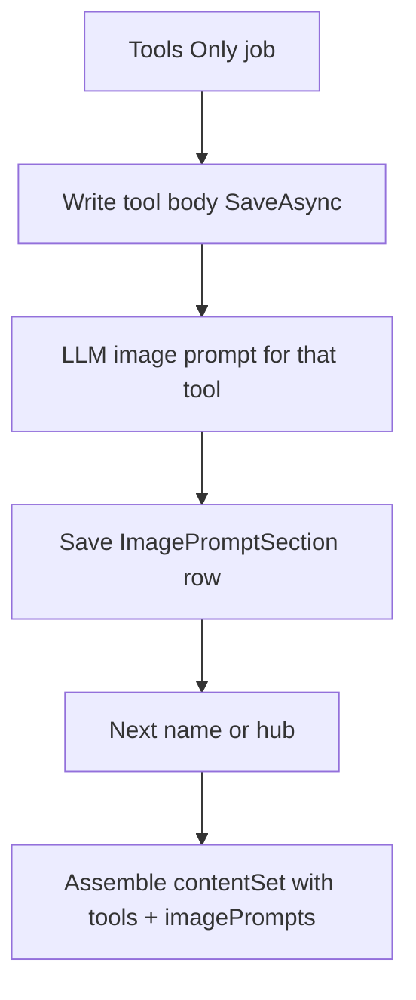

# Tools Only: image prompts per tool

**Status:** Planned

## Goal

Running **Tools Only** (paste names → `POST …/generate/tools-from-names`) must leave the project with:

- Tool documents (unchanged), **and**
- One **image-prompt row per tool** (`sourceType: "tool"`, heading = tool title), same shape Step 7 already shows under “Tool pages” and exports under `image-prompts/sections/`.

No blog/pillar required. One prompt per tool page (including the Top AI Tools hub), not per H2 section of the tool body — matches today’s Step 7 tool targets in `GeekAPI` `ContentDocumentText.BuildSectionTargets`.

## Approach

Reuse existing storage/UI (`ImagePromptSection` + `ImagePromptsView`), not a new content type. Generate with the existing standalone prompt builder (`BuildStandaloneImagePrompt`) so we do not invent a fake blog for `BuildSectionImagePromptsPrompt`.

## GeekAPI changes

### 1. Stable slug identity for tool prompts

In `ContentGenerationOrchestrator.ImagePromptSectionIdentity`, when `sourceType` is `tool`, slug = `tool-h2-{headingSlug}` (no article/blog prefix).

That way Tools Only and a later Step 7 regenerate replace the same rows instead of leaving duplicates under different prefixes.

### 2. Shared helper on the orchestrator

Add `EnsureToolImagePromptAsync(project, toolTitle, order, bodyOrNull, relatedUrl, provider, ct)` that:

1. Builds targets with `sourceType: "tool"`, heading = tool title, order = product order (hub order matches Step 7 over ToolPosts).
2. Calls `provider.CompleteAsync(BuildStandaloneImagePrompt(toolTitle, notes: project keyword/brief, artifactContext: truncated body flatten))`.
3. Parses JSON into `ImagePromptSectionDraft` (prompt + defaults from `ImagePromptDefaults`; map standalone fields into Width/Height/Model/StylePreset/Notes).
4. Removes existing row with the same tool identity slug, then `AddSectionImagePromptRowAsync`.
5. `SaveAsync` after each prompt (same mid-run durability as tool bodies).

Skip regenerating a tool’s prompt only if a matching row already exists **and** its prompt body has words (mirror the ≥20-word keep rule for tool pages), so re-runs stay cheap.

### 3. Call sites

- `GenerateToolPagesFromNamesAsync`: after each product page save (or keep), run `EnsureToolImagePromptAsync`; after hub save/keep, run once for the hub title.
- `GenerateToolPagesAsync` (crawl / Step 6): same after each product + hub, so tools generation without Step 7 still gets prompts.

Do **not** change Step 7’s blog requirement; Tools Only no longer depends on it for tool figures.

### 4. Job progress totals

In `ToolsGenerationJobRunner` / progress callbacks:

- Names job total = `(names.Count + 1) * 2` (page + prompt for each product and hub).
- Crawl job: when total is known, double the same way (or set total when product list resolves).

Report progress after each page **and** each prompt.

## UI (GeekContentCreator)

- `ToolsFromNamesPanel.tsx`: success copy notes tool pages **and** image prompts; progress string can stay `completed/total` from the job.
- Parent already receives `GeneratedContentSet` via `onGenerated` — Image Prompts tab already groups `sourceType === "tool"` in `ContentResults.tsx` `ImagePromptsView`.
- Empty-tab hint: if tools-only produced image prompts, do not insist on “Run Step 7” when `imagePrompts.sections` is non-empty.

No new API routes; async 202 job already returns full `contentSet` on complete.

## Explicitly out of scope

- Generating actual image pixels / calling an image model
- Per-H2 prompts inside each tool body
- Making Step 7 work without a blog for pillar/blog heroes
- Changing JSON-LD `image` away from publisher logo

## Done when

Tools Only on a project with N names yields N product ToolPosts + hub + N+1 `sourceType: "tool"` image-prompt rows, visible under Image Prompts and present in Export zip, with no blog and no Step 7 click.

## Implementation todos

1. GeekAPI: tool image-prompt slug identity without article prefix
2. GeekAPI: `EnsureToolImagePromptAsync` via `BuildStandaloneImagePrompt` + save
3. GeekAPI: call helper from names + crawl tool generation; double job progress
4. GCC: ToolsFromNames success/empty-tab copy for tool image prompts
